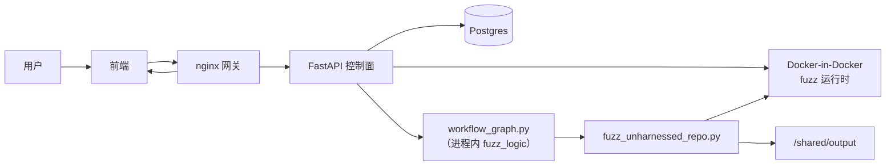
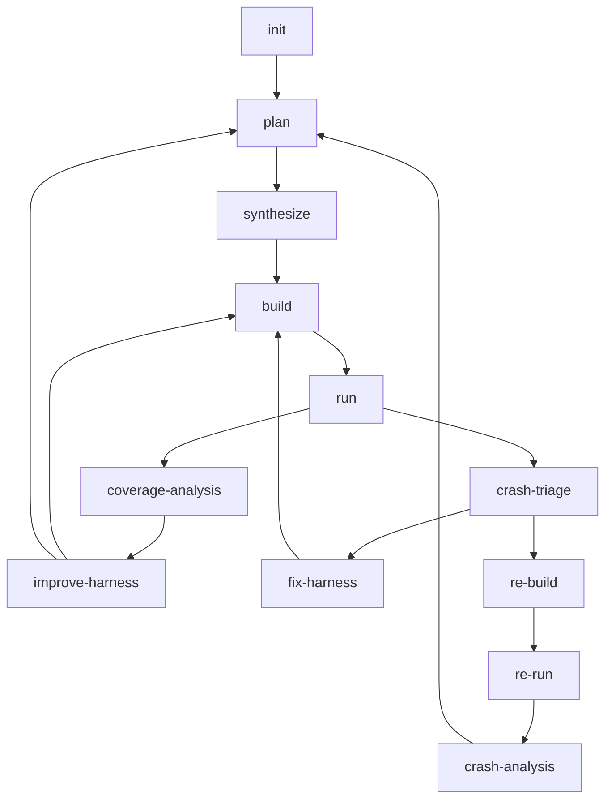

<p align="center">
  
</p>

# Sherpa

Sherpa 是一个面向公开仓库的 fuzz 编排系统。它解决的不是“单次生成一个 harness”这一个动作，而是把一个仓库的 fuzz 工作拆成可恢复、可观测、可复现的阶段闭环。

Sherpa 当前关注的是完整流程：

- 选目标
- 产脚手架
- 构建
- 运行
- 覆盖率改进
- 崩溃分诊
- 崩溃复现与分析

## 系统构成



职责边界：

- 控制面：[`harness_generator/src/langchain_agent/main.py`](harness_generator/src/langchain_agent/main.py)
- 工作流状态机：[`harness_generator/src/langchain_agent/workflow_graph.py`](harness_generator/src/langchain_agent/workflow_graph.py)
- 执行原语：[`harness_generator/src/fuzz_unharnessed_repo.py`](harness_generator/src/fuzz_unharnessed_repo.py)
- 阶段级 AI 契约：[`harness_generator/src/langchain_agent/opencode_skills/`](harness_generator/src/langchain_agent/opencode_skills/)

## 当前主工作流

Sherpa 的主线可以按三条闭环理解：



阶段职责：

- `plan`：生成目标规划、执行意图和目标元数据。
- `synthesize`：在 `fuzz/` 下生成可构建脚手架。
- `build`：编译脚手架并校验目标覆盖是否真的落地。
- `run`：初始化种子、执行 fuzzer、采集 coverage / execs / crash 信号。
- `coverage-analysis`：判断是继续原地改进还是重新规划。
- `improve-harness`：在不切换目标的前提下提升当前目标表现。
- `crash-triage`：把候选 crash 分成 harness 问题、上游问题或不确定。
- `fix-harness`：只修 harness 侧缺陷。
- `re-build` / `re-run`：在隔离复现链路中重建并回放崩溃。
- `crash-analysis`：对已复现 crash 做误报/真实 bug 分流，误报回 `plan`，否则停止并保留分析结果。

补充（当前实现口径）：

- plateau 检测窗口固定为 30 秒（`idle_no_growth=30s`）。
- `run_no_progress`、`run_timeout`、`run_idle_timeout`、`run_finalize_timeout`、`run_resource_exhaustion` 属于可恢复 run 信号，会进入 `coverage-analysis` 持续改进闭环。

说明：

- `fix_build`、`fix_crash` 仍有兼容节点，但不是当前主线推荐路径。
- 文档里的“当前主线”以当前代码路径与阶段路由为准，不以历史交接材料为准。

## 关键产物

典型任务目录：

- `/shared/output/<repo>-<shortid>/`

常见输出：

- `fuzz/PLAN.md`
- `fuzz/targets.json`
- `fuzz/selected_targets.json`
- `fuzz/execution_plan.json`
- `fuzz/harness_index.json`
- `fuzz/analysis_context.json`
- `fuzz/constraint_memory.json`
- `fuzz/repo_understanding.json`
- `fuzz/build_strategy.json`
- `fuzz/build_runtime_facts.json`
- `run_summary.json`
- `crash_info.md`
- `crash_analysis.md`
- `crash_triage.json`
- `repro_context.json`

阶段作业记录：

- `/shared/output/_jobs/<job_id>/stage-*.json`
- `/shared/output/_jobs/<job_id>/stage-*.error.txt`

## API 概览

前端与外部工具主要通过 `main.py` 暴露的 API 与系统交互：

- `POST /api/task`
- `GET /api/task/{job_id}`
- `POST /api/task/{job_id}/resume`
- `POST /api/task/{job_id}/stop`
- `GET /api/tasks`
- `GET /api/system`
- `PUT /api/config`

详细契约见 [`docs/API_REFERENCE.md`](docs/API_REFERENCE.md)。

## 部署

### 推荐阅读顺序

1. [`docs/README.md`](docs/README.md) — 文档索引
2. [`docs/CODEBASE_TECHNICAL_ANALYSIS.md`](docs/CODEBASE_TECHNICAL_ANALYSIS.md) — 代码库分层
3. [`docs/TECHNICAL_DEEP_DIVE.md`](docs/TECHNICAL_DEEP_DIVE.md) — 核心循环
4. [`docs/API_REFERENCE.md`](docs/API_REFERENCE.md) — API 契约
5. [`docs/DEPLOYMENT_GUIDE.md`](docs/DEPLOYMENT_GUIDE.md) — **部署指南**
6. [`docs/DEPLOYMENT_PITFALLS.md`](docs/DEPLOYMENT_PITFALLS.md) — 历史踩坑记录

### 运行模式

Sherpa 当前采用 **Docker Compose 本地部署**：

- FastAPI 后端 + Postgres + Docker-in-Docker 常驻
- 各工作流阶段在进程内通过 `fuzz_logic()` 直接执行（`_execute_docker_stage`）
- fuzz 运行时容器（build/run 隔离）由 dind 侧车管理
- 前端通过 nginx 网关统一代理到后端 API
- 共享输出目录通过 Docker volume 在服务间共享

### 快速启动

```bash
# 1. 启动全栈
sg docker -c "docker compose up -d"

# 2. 验证
curl -s http://localhost:8000/api/system | python3 -m json.tool

# 3. 打开控制台
# http://localhost:8000
```

详细部署步骤、问题排查和注意事项见 [`docs/DEPLOYMENT_GUIDE.md`](docs/DEPLOYMENT_GUIDE.md)。

## 开发流程

标准路径：

1. 从 `dev` 拉分支开发
2. 提交 PR 到 `dev`
3. 等待 `dev` 验证通过
4. 再从 `dev` 发 PR 到 `main`

更详细的流程见 [`docs/STANDARD_CHANGE_PROCESS.md`](docs/STANDARD_CHANGE_PROCESS.md)。
