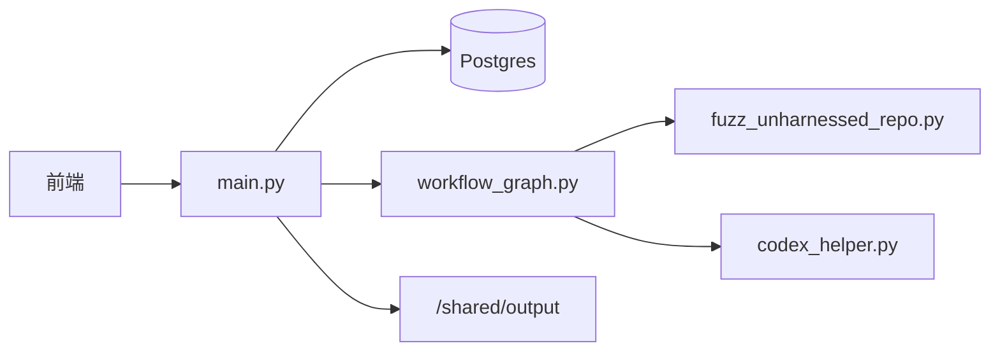
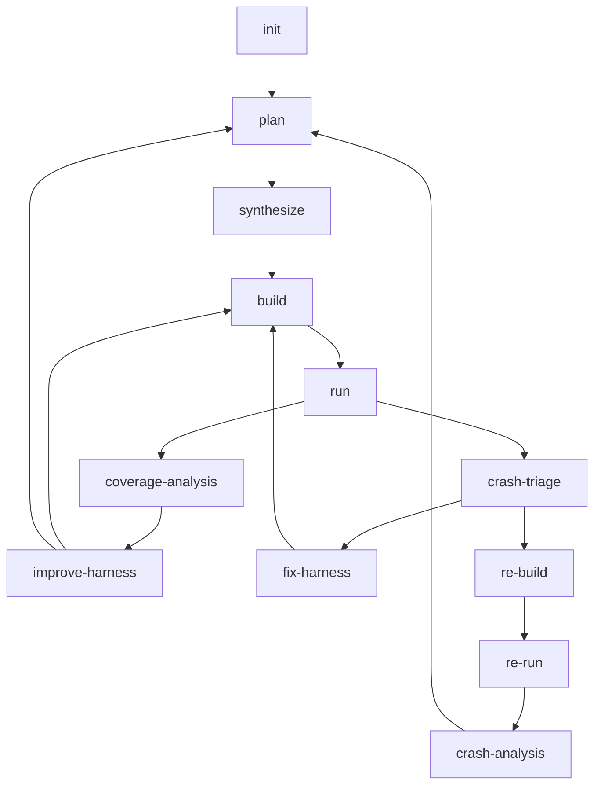

# Sherpa 代码库技术分析

本文档从代码结构出发，解释 Sherpa 当前是如何把 fuzz 工程闭环跑起来的。

## 1. 系统目标

Sherpa 自动化的是整个 fuzz 编排闭环，而不是单点 harness 生成。

目标包括：

- 选择运行时可行的目标
- 生成可构建脚手架
- 生成并评估种子
- 执行 fuzzer 并采集覆盖率与崩溃信号
- 区分 harness bug、上游 bug、覆盖率平台期
- 通过独立复现链路确认 crash 结论

## 2. 代码分层

### `harness_generator/src/langchain_agent/main.py`

控制面入口，负责：

- 暴露 FastAPI 路由
- 创建、恢复、停止任务
- 聚合 `/api/task*`、`/api/tasks`、`/api/system`、`/api/config`
- 分发阶段作业
- 维护前端所需的系统视图

### `harness_generator/src/langchain_agent/workflow_graph.py`

工作流状态机，负责：

- 定义节点与状态
- 决定阶段间路由
- 处理 repair mode / coverage improvement / crash triage
- 协调 `re-build` / `re-run` / `crash-analysis` 的复现链路

这是理解“为什么会进入下一阶段”的首要入口。

### `harness_generator/src/fuzz_unharnessed_repo.py`

执行原语层，负责：

- clone 仓库
- 执行 OpenCode 阶段任务
- 生成脚手架与构建脚本
- 初始化种子
- 执行 build / run / re-run
- 产出质量信号、崩溃产物与中间报告

### `harness_generator/src/codex_helper.py`

OpenCode 调用封装，负责：

- 阶段化 prompt 拼装
- 会话与 sentinel 管理
- 只读命令白名单
- `./done` 完成信号处理

### `harness_generator/src/langchain_agent/opencode_skills/`

阶段级 skill 契约所在目录。工作流不是直接让模型“自由发挥”，而是通过 skill 固化每个阶段的目标、输入、输出与验收标准。

## 3. 当前主线工作流

### `plan`

产出规划产物，而不是 harness 本身：

- `fuzz/PLAN.md`
- `fuzz/targets.json`
- `fuzz/selected_targets.json`（含 `target_score` 与 `target_score_breakdown`）
- `fuzz/execution_plan.json`
- `fuzz/target_analysis.json`

这一阶段回答的是：该 fuzz 哪些目标，目标的 seed 画像是什么，哪些目标具备运行时价值。

### `synthesize`

在 `fuzz/` 下产出脚手架：

- harness 源码
- `build.py` / `build.sh`
- `README.md`
- `repo_understanding.json`
- `build_strategy.json`
- `build_runtime_facts.json`
- `harness_index.json`

关键契约：

- `execution_plan.json` 必须能映射到真实 harness
- `README.md` 和 JSON 元数据必须互相一致

### `build`

负责编译脚手架并确认目标覆盖不是伪成功。

### `run`

负责：

- 生成或导入种子
- 运行 fuzzer
- 产出 coverage、exec/s、plateau、OOM、crash 等信号
- 输出 `SeedFeedback` / `HarnessFeedback`
- plateau 检测间隔固定 30 秒；`run_no_progress`/`run_timeout` 等可恢复错误会继续进入 `coverage-analysis`，不直接提前结束

### `coverage-analysis`

决定是：

- 继续原地改进
- 重新规划更深目标
- 或停止

### `improve-harness`

在不轻易换目标的前提下，围绕种子和 harness 行为做局部改进。

### `crash-triage`

将候选崩溃分类为：

- `harness_bug`
- `upstream_bug`
- `inconclusive`

### `re-build` / `re-run`

重建并复现崩溃输入，避免把“发现”与“验证”混在一起。

### `crash-analysis`

对已复现 crash 再做一次误报/真实 bug 分流：

- `false_positive` 回 `plan`
- `real_bug` / `unknown` 停止并保留分析产物

## 4. 产物模型

典型目录：

- `/shared/output/<repo>-<shortid>/`

重要文件：

- `fuzz/PLAN.md`
- `fuzz/targets.json`
- `fuzz/selected_targets.json`
- `fuzz/execution_plan.json`
- `fuzz/harness_index.json`
- `fuzz/analysis_context.json`
- `fuzz/constraint_memory.json`
- `fuzz/repo_understanding.json`
- `fuzz/build_strategy.json`
- `fuzz/build_runtime_facts.json`
- `run_summary.json`
- `crash_info.md`
- `crash_analysis.md`
- `crash_triage.json`
- `repro_context.json`

阶段结果文件：

- `/shared/output/_jobs/<job_id>/stage-*.json`
- `/shared/output/_jobs/<job_id>/stage-*.error.txt`

## 5. 种子与质量流水线

种子处理是画像驱动的，不是单纯随机补样。

关键概念：

- `seed_profile` 决定输入家族
- 仓库样例优先
- AI 生成补齐语义缺口
- 受控变异只是辅助
- 过滤偏软，避免误杀有效样本
- 种子评分写回 `seed_quality_<target>.json`

工作流会消费：

- `SeedFeedback`
- `HarnessFeedback`
- `coverage_quality_oracle`

## 6. 代码阅读顺序

建议顺序：

1. [`../README.md`](../README.md)
2. [`CODEBASE_TECHNICAL_ANALYSIS.md`](CODEBASE_TECHNICAL_ANALYSIS.md)
3. [`workflow_graph.py`](../harness_generator/src/langchain_agent/workflow_graph.py)
4. [`fuzz_unharnessed_repo.py`](../harness_generator/src/fuzz_unharnessed_repo.py)
5. [`main.py`](../harness_generator/src/langchain_agent/main.py)
6. [`codex_helper.py`](../harness_generator/src/codex_helper.py)
7. [`opencode_skills/`](../harness_generator/src/langchain_agent/opencode_skills/)

## 7. 需要特别注意的兼容点

当前代码里仍然存在一些兼容节点或兼容字段：

- `fix_build`
- `fix_crash`
- 一些历史阶段名字的别名

它们属于兼容实现和恢复入口，不应被误读成主线推荐路径。
