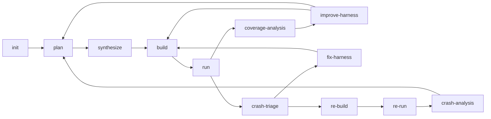

# Sherpa 技术深潜

这是一份“怎么快速把项目读懂”的资料，不是交接流水账。

## 1. 先建立心智模型

Sherpa 不是“一个 harness 生成器”，而是一个 fuzz 编排系统。

你可以把它拆成四层：

1. UI
   提交任务、看系统指标、查看任务状态。

2. 控制面
   `main.py` 暴露 API、持久化任务、派发阶段作业。

3. 工作流状态机
   `workflow_graph.py` 决定下一步该做什么。

4. 执行层
   `fuzz_unharnessed_repo.py` 负责 clone / build / run / OpenCode。

如果把第 3 层和第 4 层混在一起，会很难读。

## 2. 推荐阅读顺序

1. [`../README.md`](../README.md)
2. [`CODEBASE_TECHNICAL_ANALYSIS.md`](CODEBASE_TECHNICAL_ANALYSIS.md)
3. `harness_generator/src/langchain_agent/workflow_graph.py`
4. `harness_generator/src/fuzz_unharnessed_repo.py`
5. `harness_generator/src/langchain_agent/main.py`
6. `harness_generator/src/codex_helper.py`
7. `harness_generator/src/langchain_agent/opencode_skills/`

## 3. 当前工作流应该怎么记

理解这条链路时要注意：

- `build` 失败不应该被当成“任务结束”，而应该回到修复规划语境
- `run` 后如果没有崩溃，先看覆盖率改进，而不是盲目换目标
- `re-run` 后如果复现成功，还要做 `crash-analysis`，否则很容易把 harness 误报当成真 bug
- plateau 检测窗口固定为 30 秒；`run_no_progress`、`run_timeout` 等可恢复 run 信号会进入 `coverage-analysis` 继续改进

## 4. 三个核心循环

### 4.1 目标规划循环

产物：

- `fuzz/PLAN.md`
- `fuzz/targets.json`
- `fuzz/selected_targets.json`（含 `target_score_breakdown`）
- `fuzz/execution_plan.json`
- `fuzz/analysis_context.json`

核心问题：

- 这个仓库应该 fuzz 什么
- 目标是否真的可运行
- 哪些目标值得优先投入 seed / build 预算

### 4.2 种子质量循环

产物：

- `fuzz/corpus/<target>/`
- `fuzz/seed_quality_<target>.json`

核心问题：

- 样例是不是“真实且有效”
- family 覆盖有没有缺口
- 语义有效样本是不是足够
- 变异出来的东西是不是只是在制造噪声

### 4.3 崩溃与复现循环

产物：

- `crash_info.md`
- `crash_triage.json`
- `crash_analysis.md`
- `repro_context.json`
- `fuzz/constraint_memory.json`

核心问题：

- crash 是 harness 问题还是上游问题
- 是否真的可复现
- 即使能复现，是否只是错误输入触发的 harness 误报

## 5. 当前最常见的失败模式

### 目标太浅

表现：

- build / run 很快成功
- coverage 增长很少
- 很快平台期

### execution plan 和 harness 漂移

表现：

- `execution_plan.json` 里的目标文件不存在
- build 统计显示 `built=0/x`
- synthesize 看起来成功，但其实没有把目标落地

### 种子质量很差

表现：

- 语料很多
- family 覆盖不足
- 噪声文件比例高
- coverage 收益弱

### crash 其实是 harness 误报

表现：

- 崩溃输入很短或很怪
- 复现后只在 harness 侧抛异常
- 看起来像漏洞，实际是调用方式错了

## 6. 学习代码时的判断标准

当你读一个阶段实现时，问自己三个问题：

1. 它输入了什么证据
2. 它输出了什么可验证产物
3. 它如何决定下一阶段

这三个问题比“它用了什么模型”更重要。

## 7. 运维时怎么读日志

顺序建议：

1. `/app/job-logs/jobs/<job_id>.log`
2. `/shared/output/_jobs/<job_id>/stage-*.json`
3. `/shared/output/<repo>-<id>/run_summary.json`
4. 如果有 crash，再看 `crash_info.md` / `crash_analysis.md` / `crash_triage.json`

## 8. 历史材料怎么看

如果旧文档里还出现：

- 历史迁移清单
- inner Docker 执行假设
- 旧阶段顺序

把它们视为历史背景，不要当成当前事实来源。
