# GBrain 项目详细介绍

## 1. 项目概览

GBrain 是一个面向 AI Agent 的个人知识大脑系统。它把 Markdown 知识库、Postgres/pgvector 检索、MCP 工具、技能路由、实体图谱、后台任务队列和维护流程组合在一起，让 Agent 不只是临时回答问题，而是能持续积累、检索、更新和治理一套长期记忆。

| 项目属性 | 说明 |
| --- | --- |
| 项目名称 | GBrain |
| 当前版本 | `0.17.0`，见 `VERSION` |
| 包版本 | `0.16.4`，见 `package.json` |
| 定位 | Postgres-native personal knowledge brain with hybrid RAG search |
| 主要语言 | TypeScript |
| 运行时 | Bun |
| 默认数据库 | PGLite，嵌入式 Postgres WASM |
| 生产数据库路径 | Postgres + pgvector，通常可用 Supabase 托管 |
| Agent 接入方式 | CLI、MCP stdio、远程 MCP、技能文件 |
| 文档入口 | `AGENTS.md`、`CLAUDE.md`、`llms.txt`、`llms-full.txt` |
| 核心理念 | Agent 很聪明但健忘，GBrain 给它长期大脑 |

GBrain 的核心不是单一数据库或单一 RAG 脚本，而是一整套知识运行时：

- 用 Markdown 保留人类可读、可编辑的知识源。
- 用 PGLite 或 Postgres + pgvector 提供可查询、可迁移的存储层。
- 用统一操作契约同时生成 CLI 和 MCP 工具。
- 用技能文件告诉 Agent 在不同任务中如何读、写、摄取、富化、维护知识。
- 用实体链接、时间线、反向链接和混合搜索提升检索质量。
- 用 Minions 队列承载可恢复、可审计的后台任务。

## 2. 总体架构图

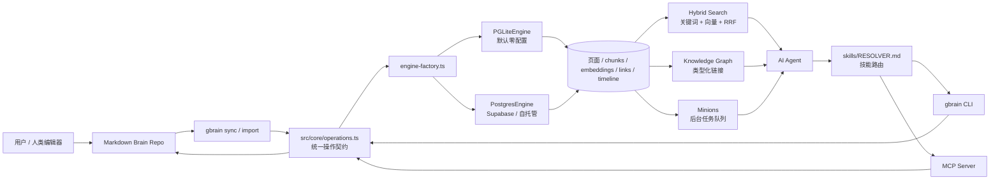

这张图可以抓住 GBrain 的基本分层：

| 层级 | 主要文件/目录 | 职责 |
| --- | --- | --- |
| 交互层 | `src/cli.ts`、`src/mcp/server.ts` | 面向人和 Agent 暴露命令/工具 |
| 契约层 | `src/core/operations.ts` | 定义共享操作，是 CLI 与 MCP 的共同来源 |
| 引擎层 | `src/core/engine.ts`、`pglite-engine.ts`、`postgres-engine.ts` | 屏蔽底层数据库差异 |
| 检索层 | `src/core/search/` | 混合搜索、查询扩展、意图识别、去重、评估 |
| 摄取层 | `src/core/import-file.ts`、`sync.ts`、`chunkers/` | 导入、同步、分块、embedding |
| 图谱层 | `src/core/link-extraction.ts`、`commands/extract.ts`、`graph-query.ts` | 类型化实体链接和关系遍历 |
| 任务层 | `src/core/minions/`、`commands/jobs.ts`、`commands/agent.ts` | 可恢复后台任务和持久化 subagent |
| 技能层 | `skills/` | Agent 的工作流说明、质量标准和任务路由 |
| 文档层 | `docs/`、`recipes/`、`templates/` | 部署、集成、设计、模板和操作手册 |

## 3. 安装与初始化流程

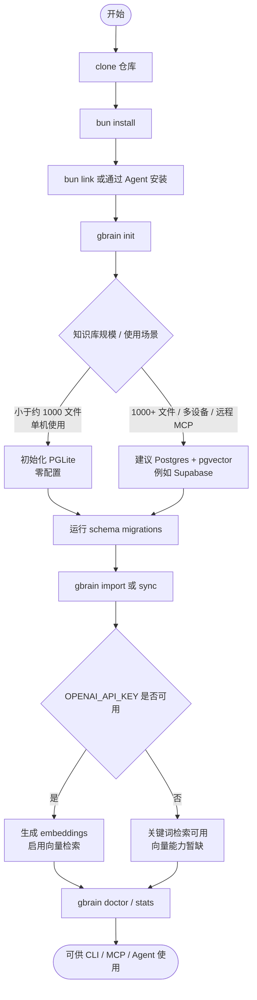

常用安装命令：

```bash
git clone https://github.com/garrytan/gbrain.git
cd gbrain
bun install
bun link
gbrain init
gbrain import ~/notes/
gbrain query "what themes show up across my notes?"
```

注意：README 明确不建议使用 `bun install -g github:garrytan/gbrain`，因为 Bun 的全局安装会阻止顶层 `postinstall`，可能导致 schema migration 没有运行。

## 4. 数据模型

GBrain 的核心对象是页面。页面通常来自 Markdown 文件，并在数据库中被拆成可检索的结构：

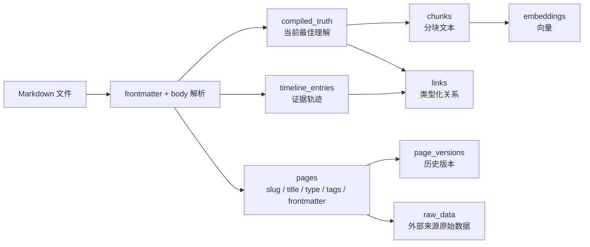

推荐的页面语义是“编译真相 + 时间线”：

```markdown
---
type: concept
title: Example Concept
tags: [knowledge, example]
---

这里是当前最佳理解，可以随着新证据被重写。

---

- 2026-04-26: 这里是只追加的证据轨迹。
```

| 区域 | 用途 | 更新方式 |
| --- | --- | --- |
| Frontmatter | 类型、标题、标签、来源元数据 | 结构化维护 |
| 编译真相 | 对主题的当前最佳总结 | 可重写、可合并 |
| 时间线 | 事实和证据的发生顺序 | 只追加，保留审计轨迹 |
| Links | 人、公司、概念、项目之间的关系 | 写入后自动提取或批量回填 |
| Chunks/Embeddings | 检索索引 | 导入、同步、嵌入刷新时生成 |

### 4.1 Chunks 之间的关系与 RAG 碎片化问题

`content_chunks` 之间目前没有显式的“边关系”。也就是说，GBrain 不会直接存储类似 `chunk A -> chunk B`、`chunk A 支撑 chunk C`、`chunk A 反驳 chunk D` 这样的 chunk-to-chunk 图谱。

它的结构更接近：

```text
chunk -> page
page  -> page
page  -> timeline_entries
```

每个 chunk 通过 `page_id` 归属于某个页面，通过 `chunk_index` 保留在原文里的顺序；页面之间再通过 `links` 形成知识图谱。因此，chunk 是检索入口，不是最终的知识理解单位。

例如，一个 chunk 可能是：

```text
chunk_text: Alice 正在推动 Acme 的 GraphQL migration，目标是 Q3 完成。
page_id: people/alice-example
chunk_index: 2
chunk_source: compiled_truth
```

它本身不会直接链接到另一个 chunk。但系统可以沿着 `page_id` 回到 `people/alice-example` 页面，再读取这个页面的 `compiled_truth`、`timeline_entries`、`frontmatter` 和相关 `links`。

GBrain 解决普通 RAG “检索结果太碎”的方式，不是把 chunk 自身做成复杂图，而是把命中的 chunk 放回更大的上下文中：

1. **先命中 chunk，再回到 page。**  
   向量检索或关键词检索命中的是 chunk，但回答时可以回到它所属的页面，读取完整的当前结论、元数据和关系。

2. **用 `compiled_truth` 承载当前综合判断。**  
   普通 RAG 常把会议、邮件、笔记片段直接丢给模型，让模型临时拼答案。GBrain 会把长期积累的信息压缩进 `compiled_truth`，让“当前最佳理解”优先出现在检索结果中。

3. **用 `chunk_source` 区分结论和证据。**  
   chunk 可以来自 `compiled_truth`，也可以来自 timeline 或其他正文区域。检索时可以让 `compiled_truth` 权重更高，把 timeline 当作证据补充。

4. **用 `links` 把碎片扩展成实体网络。**  
   chunk 没有直接关系边，但 page 有。一个会议 chunk 命中后，可以通过 links 找到相关人物、公司、项目和概念页面。

5. **用 `timeline_entries` 重建时间顺序。**  
   碎片化检索常常丢失时间线。GBrain 把事件抽成结构化时间线，可以回答“最近发生了什么”“这个判断从何而来”“某个关系如何变化”这类问题。

一个典型查询流程如下：

```text
用户问题:
Acme 的 GraphQL 迁移现在是谁负责，风险是什么？

检索命中:
- meetings/2026-04-07-api-sync 的一个 chunk
- people/alice-example 的 compiled_truth chunk
- projects/graphql-migration 的一个 chunk

系统聚合:
- 回到相关 pages
- 读取 compiled_truth
- 沿 links 找 Alice、Acme、GraphQL migration 的关系
- 按 timeline_entries 排列证据

最终回答:
Alice 目前是主要推进人。依据是 4 月 7 日 API sync 中她明确 owner
迁移计划，后续 roadmap 把该迁移列入 Q3 目标。主要风险是 Q3 时间线
偏紧，以及测试覆盖不足可能拖慢发布。
```

所以，GBrain 的检索单位和理解单位是分层的：

| 层级 | 作用 |
| --- | --- |
| chunk | 搜索入口，负责召回相关文本片段 |
| page | 语义聚合单位，承载当前结论和元数据 |
| links | 实体关系网络，把页面串起来 |
| timeline_entries | 证据链和时间顺序 |
| compiled_truth | 面向回答的当前最佳综合判断 |

换句话说，GBrain 的策略是：**不要让 chunk 成为知识的最终单位；chunk 只负责把系统带到正确位置，page、graph 和 timeline 才负责理解。**

## 5. 写入与自动图谱流程

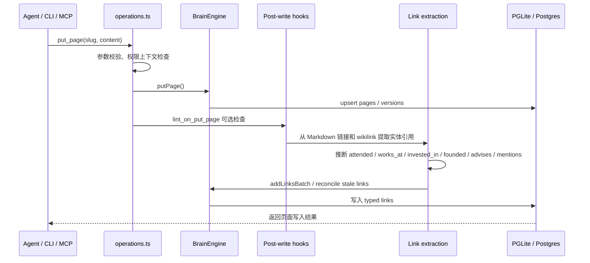

自动图谱的关键点：

- 不依赖 LLM 判断基础关系，主要通过确定性解析和启发式推断。
- 支持 Markdown 链接和 Obsidian 风格 wikilink。
- 关系类型包括 `attended`、`works_at`、`invested_in`、`founded`、`advises`、`source`、`mentions` 等。
- 页面更新后会协调过期链接，避免旧关系长期污染图谱。
- 反向链接和关系密度会进入检索与健康检查。

### 5.1 一个具体 Page 写入后发生什么

假设写入一个会议页面：

```text
meetings/2026-04-07-api-sync.md
```

文件路径会变成页面 slug：

```text
meetings/2026-04-07-api-sync
```

页面内容可以是：

```markdown
---
type: meeting
title: API Sync with Acme
tags: [meeting, api, graphql]
attendees:
  - people/alice-example
companies:
  - companies/acme-example
projects:
  - projects/graphql-migration
---

## Summary

Met with [[people/alice-example|Alice Example]] from [[companies/acme-example|Acme Example]].

Alice confirmed she is owning [[projects/graphql-migration|GraphQL Migration]]
and wants to complete the first production rollout by Q3.

## Assessment

Alice seems highly committed to the migration, but the timeline is tight.
The main risk is that test coverage is not yet strong enough for a safe rollout.

---

## Timeline

- 2026-04-07: Alice confirmed ownership of GraphQL migration and Q3 rollout target.
  Source: API sync meeting notes.
```

写入后，GBrain 不只是保存这篇 Markdown，而是把它拆成多张结构化表。

**1. 写入 `pages`：页面主体**

```text
slug: meetings/2026-04-07-api-sync
type: meeting
title: API Sync with Acme
compiled_truth:
  Summary + Assessment 部分
timeline:
  Timeline 部分
frontmatter:
  {
    "type": "meeting",
    "title": "API Sync with Acme",
    "tags": ["meeting", "api", "graphql"],
    "attendees": ["people/alice-example"],
    "companies": ["companies/acme-example"],
    "projects": ["projects/graphql-migration"]
  }
```

通俗讲，`pages` 存的是这个知识节点的当前主体内容：标题、类型、当前综合判断、证据时间线和结构化元数据。

**2. 写入 `tags`：标签索引**

```text
meetings/2026-04-07-api-sync -> meeting
meetings/2026-04-07-api-sync -> api
meetings/2026-04-07-api-sync -> graphql
```

这些标签让后续可以按主题或类型快速筛选页面。

**3. 写入 `content_chunks`：检索片段**

页面会被切成多个 chunk：

```text
chunk 0
chunk_source: compiled_truth
chunk_text:
  Met with Alice Example from Acme Example.
  Alice confirmed she is owning GraphQL Migration...

chunk 1
chunk_source: compiled_truth
chunk_text:
  Alice seems highly committed to the migration,
  but the timeline is tight...

chunk 2
chunk_source: timeline
chunk_text:
  2026-04-07: Alice confirmed ownership of GraphQL migration...
```

如果 embedding 可用，每个 chunk 还会生成向量，写入 `content_chunks.embedding`。这样用户用不同说法提问时，语义搜索也能召回这页。

**4. 写入 `links`：自动图谱边**

页面正文里的 wikilink 会生成 Markdown 来源的边：

```text
from: meetings/2026-04-07-api-sync
to: people/alice-example
link_type: mentions 或 attended
link_source: markdown

from: meetings/2026-04-07-api-sync
to: companies/acme-example
link_type: mentions
link_source: markdown

from: meetings/2026-04-07-api-sync
to: projects/graphql-migration
link_type: mentions
link_source: markdown
```

frontmatter 里的结构化字段也会生成 frontmatter 来源的边：

```text
from: meetings/2026-04-07-api-sync
to: people/alice-example
link_type: attended
link_source: frontmatter
origin_field: attendees

from: meetings/2026-04-07-api-sync
to: companies/acme-example
link_type: mentions
link_source: frontmatter
origin_field: companies

from: meetings/2026-04-07-api-sync
to: projects/graphql-migration
link_type: mentions
link_source: frontmatter
origin_field: projects
```

`link_source` 很关键。它让 GBrain 知道一条边来自 Markdown、frontmatter 还是人工添加。页面更新时，系统可以只清理这个页面自动生成的旧边，不会误删人工维护的关系。

**5. 写入 `timeline_entries`：结构化事件**

Timeline 会被抽成结构化事件：

```text
page: meetings/2026-04-07-api-sync
date: 2026-04-07
summary: Alice confirmed ownership of GraphQL migration and Q3 rollout target.
source: API sync meeting notes.
```

如果是会议摄取技能完整运行，还会把关键事实传播到相关实体页：

```text
page: people/alice-example
date: 2026-04-07
summary: Confirmed ownership of Acme's GraphQL migration and Q3 rollout target.
source: API Sync with Acme

page: companies/acme-example
date: 2026-04-07
summary: GraphQL migration ownership and Q3 rollout target confirmed by Alice.
source: API Sync with Acme
```

这一步让会议页不再是孤岛。它会把相关人物、公司、项目都更新成可追溯的长期记忆。

### 5.2 自动图谱如何避免旧关系污染

自动图谱不是只会新增边，也会做 reconciliation，也就是关系协调。

例如某个人物页原来写：

```yaml
company: companies/old-company
```

后来改成：

```yaml
company: companies/acme-example
```

如果不清理旧边，图谱里会同时存在：

```text
people/alice-example -> companies/old-company
people/alice-example -> companies/acme-example
```

这会污染关系查询。GBrain 的做法是：

```text
1. 重新解析当前页面中的 Markdown 链接、wikilink 和 frontmatter。
2. 找出这个页面之前自动生成的边。
3. 删除当前页面已经不再声明的旧边。
4. 写入新的边。
5. 保留 manual 人工边和其他页面产生的边。
```

最终图谱大概会变成：

```text
meetings/2026-04-07-api-sync
  -> people/alice-example
  -> companies/acme-example
  -> projects/graphql-migration

people/alice-example
  -> companies/acme-example
  -> meetings/2026-04-07-api-sync

companies/acme-example
  -> people/alice-example
  -> projects/graphql-migration
  -> meetings/2026-04-07-api-sync
```

这样用户问：

```text
Acme 的 GraphQL 迁移是谁负责，风险是什么？
```

GBrain 可以同时利用：

```text
people/alice-example 的 compiled_truth
companies/acme-example 的当前状态和风险
meetings/2026-04-07-api-sync 的会议证据
timeline_entries 的日期
links 表里的实体关系
content_chunks 的关键词/向量命中
```

给出带来源、带关系、带时间顺序的回答，而不是只返回几个孤立文本片段。

## 6. 查询与混合搜索流程

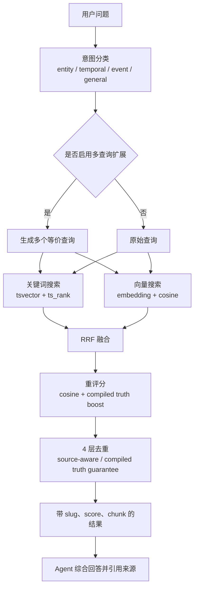

### 6.1 Hybrid Search + RRF 如何减少单一路径误差

GBrain 不把检索押注在单一路径上。单独使用关键词搜索、单独使用向量搜索、或者单独依赖 LLM 改写查询，都会有各自的盲区。

| 检索路径 | 擅长 | 容易犯的错 |
| --- | --- | --- |
| 关键词搜索 | 精确名字、术语、slug、日期、专有名词 | 用户换一种说法就可能搜不到 |
| 向量搜索 | 语义相近、同义表达、模糊问题 | 可能找出“意思像但事实不对”的内容 |
| 多查询扩展 | 补充别名、缩写、相关问法 | 扩展过头时可能引入噪音 |
| 图谱/链接 | 人、公司、项目、会议之间的关系 | 依赖已有链接质量，覆盖不足时会漏 |

Hybrid search 的作用是同时跑多条检索路径，然后把结果融合。比如用户问：

```text
谁在推进 Acme 的 API 迁移？
```

系统可能同时得到：

```text
关键词搜索:
- 命中 "Acme"、"API migration"、"Q3"

向量搜索:
- 命中 "GraphQL rollout"、"REST to GraphQL migration"

多查询扩展:
- 把 API 迁移扩展成 "GraphQL migration"、"platform migration"、"backend rewrite"

图谱关系:
- 从 Acme 找到 Alice、相关会议、相关项目页
```

这些路径的分数尺度不同，不能简单相加。关键词搜索的 `ts_rank`、向量搜索的 cosine similarity、图谱召回的关系强度并不是同一种分数。RRF，也就是 Reciprocal Rank Fusion，解决的是“不同排行榜怎么合并”的问题。

它的直觉很简单：

```text
一个结果如果在多条检索路径里都排得靠前，它大概率更重要。
一个结果如果只在某一条路径里很靠前，但其他路径完全不支持，要更谨慎。
```

例如：

| 候选页面 | 关键词排名 | 向量排名 | 图谱排名 | 融合后的直觉 |
| --- | ---: | ---: | ---: | --- |
| `people/alice-example` | 2 | 1 | 1 | 多路都支持，应排前面 |
| `meetings/2026-04-07-api-sync` | 1 | 5 | 3 | 是关键证据，也应靠前 |
| `topics/api-design` | 20 | 2 | 无 | 语义相似，但可能偏泛 |
| `people/bob-example` | 3 | 无 | 无 | 关键词命中，但证据较弱 |

融合后，GBrain 更可能优先返回 Alice 和具体会议，而不是只返回一个泛泛的 API design 页面。

RRF 之后还会继续做重评分和去重：

- `compiled_truth` 会被提高权重，因为它代表当前综合判断。
- 同一页面的多个相似 chunks 会被去重，避免结果列表被一个页面刷屏。
- source-aware dedup 会避免多 source 场景下把不同知识源的同名页面混在一起。
- query intent 会影响 detail level，例如实体查询、时间查询、事件查询会取不同粒度的上下文。

所以 Hybrid Search + RRF 解决的不是“哪个搜索算法最强”，而是更实用的问题：**当不同检索路径各有偏差时，如何让互相印证的结果浮到前面，让单一路径的误判降权。**

查询相关模块：

| 模块 | 职责 |
| --- | --- |
| `src/core/search/intent.ts` | 判断查询意图，辅助选择 detail level |
| `src/core/search/expansion.ts` | 多查询扩展，并做 prompt-injection 防御 |
| `src/core/search/keyword.ts` | Postgres 全文检索 |
| `src/core/search/vector.ts` | pgvector 向量检索 |
| `src/core/search/hybrid.ts` | RRF 融合和总体搜索管道 |
| `src/core/search/dedup.ts` | 分层去重，保证编译真相优先 |
| `src/core/search/eval.ts` | P@k、R@k、MRR、nDCG 等评估 |

README 中给出的 BrainBench v1 结果显示，混合检索和图谱层能显著改善 top-k 命中质量：

| 指标 | 优化前 | 优化后 |
| --- | ---: | ---: |
| Precision@5 | 39.2% | 44.7% |
| Recall@5 | 83.1% | 94.6% |
| Top-5 正确数 | 217 | 247 |
| 图谱 F1 | 57.8% grep baseline | 86.6% graph-only |

## 7. Agent 工作流

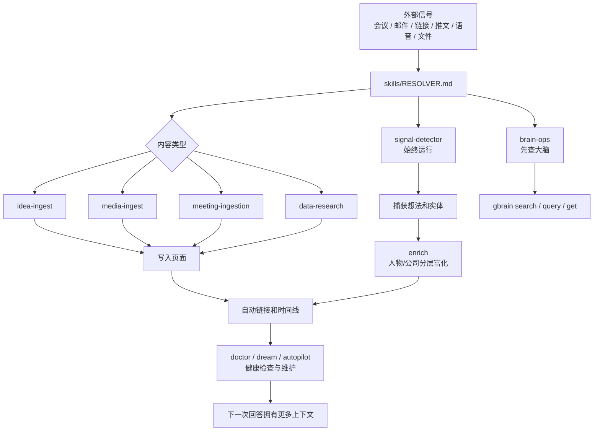

技能文件不是提示词片段，而是完整工作流说明。它们告诉 Agent：

- 什么时候触发。
- 要先读哪些上下文。
- 如何调用确定性命令。
- 如何写入页面和引用来源。
- 如何进行质量检查。
- 什么时候委托给其他技能。

主要技能类别：

| 类别 | 代表技能 | 用途 |
| --- | --- | --- |
| Always-on | `signal-detector`、`brain-ops` | 每条消息都参与信号捕获和大脑优先查找 |
| 摄取 | `ingest`、`idea-ingest`、`media-ingest`、`meeting-ingestion` | 把外部内容变成结构化脑页面 |
| 大脑操作 | `query`、`enrich`、`maintain`、`citation-fixer`、`repo-architecture` | 查询、富化、维护、归档和引用治理 |
| 运营 | `daily-task-manager`、`daily-task-prep`、`cron-scheduler`、`reports` | 日常任务、简报、定时运行 |
| 集成 | `webhook-transforms`、`data-research`、`publish` | 外部事件、结构化研究、页面发布 |
| 系统 | `setup`、`migrate`、`testing`、`skillpack-check`、`skill-creator` | 安装、迁移、技能质量和扩展 |
| 后台编排 | `minion-orchestrator` | 长任务、扇出、汇总、恢复 |

## 8. CLI 与 MCP 的契约优先设计

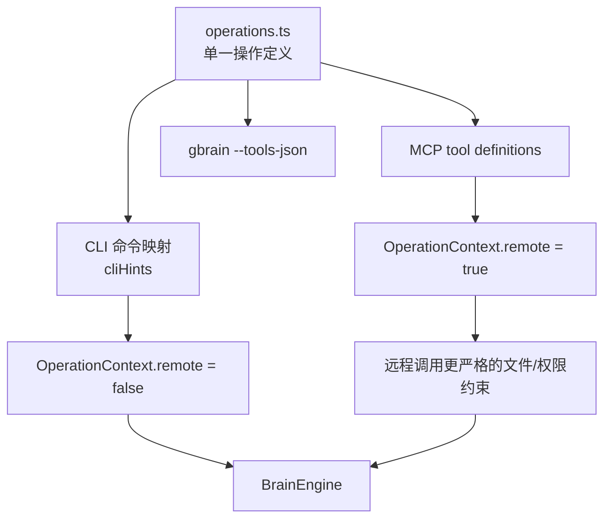

### 8.1 `operations.ts` 是什么

`src/core/operations.ts` 可以理解成 GBrain 的“能力总合同”。它不是普通工具函数文件，而是集中定义：

- GBrain 支持哪些操作。
- 每个操作叫什么。
- 每个操作需要哪些参数。
- 这个操作是否会修改数据。
- CLI 命令如何映射。
- MCP / Agent 工具如何暴露。
- 真正执行时调用哪个 handler。

一个 operation 的形状大致如下：

```ts
const get_page = {
  name: 'get_page',
  description: 'Read a page by slug',
  params: {
    slug: { type: 'string', required: true },
    fuzzy: { type: 'boolean' }
  },
  handler: async (ctx, p) => {
    return ctx.engine.getPage(p.slug)
  },
  cliHints: { name: 'get', positional: ['slug'] }
}
```

这段定义同时服务多个入口：

```text
人类在终端输入:
gbrain get people/alice-example

Agent 通过 MCP 调用:
get_page({ slug: "people/alice-example" })

内部代码执行:
op.handler(ctx, params)
```

背后走的是同一份 operation 定义。这样就不会出现 CLI、MCP、tools-json、subagent 工具各自维护一套接口、参数慢慢漂移的问题。

`operations.ts` 中的操作大致分为：

| 类别 | 代表操作 | 用途 |
| --- | --- | --- |
| 页面 CRUD | `get_page`、`put_page`、`delete_page`、`list_pages` | 读取、写入、删除、列出页面 |
| 搜索 | `search`、`query` | 关键词搜索和混合检索 |
| 标签 | `add_tag`、`remove_tag`、`get_tags` | 管理页面标签 |
| 图谱 | `add_link`、`remove_link`、`get_links`、`get_backlinks`、`traverse_graph` | 维护和遍历页面关系 |
| 时间线 | `add_timeline_entry`、`get_timeline` | 写入和读取结构化事件 |
| 管理 | `get_stats`、`get_health`、`get_versions`、`revert_version` | 统计、健康检查、版本历史 |
| 同步 | `sync_brain` | 把 Markdown repo 同步进数据库 |
| 原始数据 | `put_raw_data`、`get_raw_data` | 存放外部 API 或摄取来源的 JSON sidecar |
| 文件 | `file_list`、`file_upload`、`file_url` | 管理附件和文件 URL |
| 后台任务 | `submit_job`、`get_job`、`list_jobs`、`cancel_job`、`retry_job` | 操作 Minions 队列 |
| 孤页检查 | `find_orphans` | 找出没有入链的页面 |

每次执行 operation 时，都会带一个 `OperationContext`。它相当于“这次调用的运行环境”：

```text
ctx.engine      当前数据库引擎，PGLite 或 Postgres
ctx.config      GBrain 配置
ctx.logger      日志输出
ctx.dryRun      是否只预览不执行
ctx.remote      调用方是否远程/不可信
ctx.subagentId  是否来自子 Agent
ctx.cliOpts     CLI 全局参数
```

其中最重要的是 `ctx.remote`：

```text
remote = false  本地 CLI，可信调用
remote = true   MCP / Agent，按不可信远程调用处理
```

例如 `file_upload` 这种敏感操作，本地 CLI 可以按用户拥有机器来处理；但 MCP 面向 Agent 或远程客户端时，必须更严格地限制路径、拒绝符号链接和路径穿越。这个信任边界在 operation 层集中处理。

可以把这层关系类比成：

```text
operations.ts = 餐厅菜单 + 下单规则
BrainEngine   = 厨房
CLI / MCP     = 不同点餐入口
```

用户不管是从 CLI 点餐，还是 Agent 从 MCP 点餐，最后都按同一份菜单执行。引擎只负责“怎么把这个操作落到数据库”，operation 负责“这个能力对外是什么、参数是什么、安全规则是什么”。

这个设计带来三个重要结果：

1. 同一个操作只定义一次，CLI、MCP 和 tools-json 保持一致。
2. 引擎可以替换，操作层不用知道当前是 PGLite 还是 Postgres。
3. 信任边界明确：本地 CLI 是可信调用，MCP 面向 Agent 和远程客户端时默认更严格。

重要信任边界：

| 调用方 | `OperationContext.remote` | 安全含义 |
| --- | --- | --- |
| 本地 CLI | `false` | 用户拥有机器，文件访问约束较宽 |
| MCP Server | `true` | 面向 Agent 或远程调用，文件上传等敏感操作收紧 |
| 未明确设置 | 默认严格 | 安全敏感操作倾向 fail closed |

## 9. 可插拔引擎

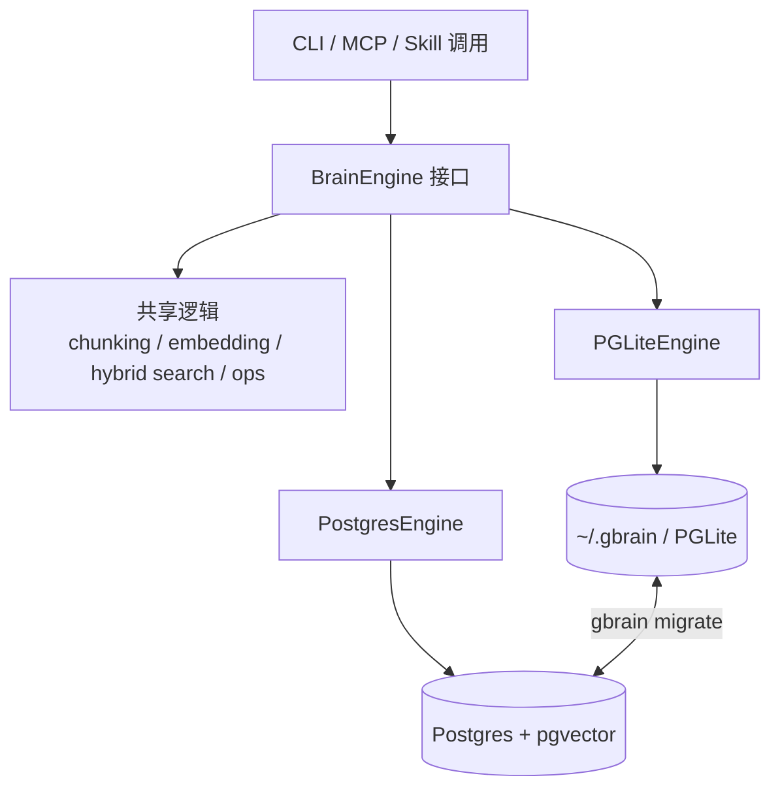

| 能力 | PGLiteEngine | PostgresEngine |
| --- | --- | --- |
| 安装复杂度 | 最低，`gbrain init` 即可 | 需要连接串和数据库服务 |
| 适合场景 | 个人、本地、快速试用 | 大规模、多设备、远程 MCP |
| SQL 能力 | 嵌入式 Postgres | 标准 Postgres |
| 向量检索 | pgvector | pgvector |
| 全文检索 | tsvector | tsvector |
| 图遍历 | recursive CTE | recursive CTE |
| 迁移 | 可迁移到 Postgres | 可迁回 PGLite |

## 10. Minions 后台任务队列

Minions 是 GBrain 内置的 Postgres-native 后台任务队列，用于把确定性、长耗时、可重试的工作从 Agent 对话中分离出来。

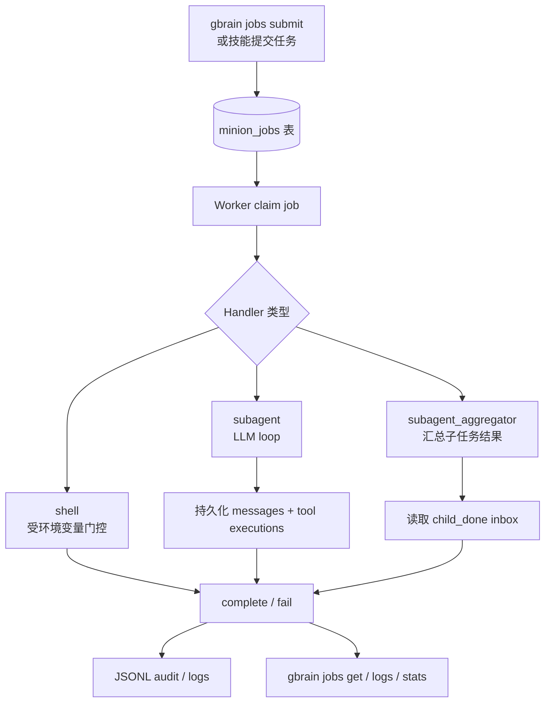

Minions 的定位：

| 工作类型 | 推荐执行方式 | 原因 |
| --- | --- | --- |
| 同步、导入、批量解析、固定脚本 | Minions | 确定性、可恢复、低成本 |
| 判断、综合、策略取舍、模糊任务 | Sub-agent | 需要模型推理 |
| 多个确定性子任务后汇总 | Minions + aggregator | 可扇出、可收集、可审计 |

常用命令：

```bash
gbrain jobs smoke
gbrain jobs submit sync --params '{}'
gbrain jobs list --status active
gbrain jobs get <id>
gbrain jobs work --concurrency 4
gbrain agent run "summarize recent project notes"
gbrain agent logs <job-id> --follow --since 5m
```

## 11. 典型端到端流程

### 11.1 导入本地 Markdown 知识库

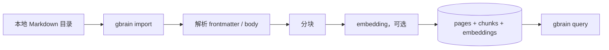

### 11.2 增量同步 Git 仓库

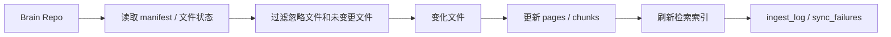

### 11.3 会议记录进入大脑

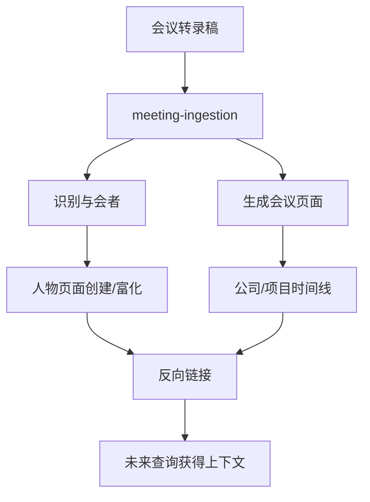

### 11.4 维护周期

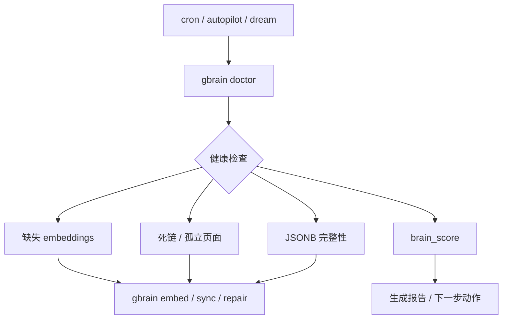

## 12. 后续扩展：代码内容的存储与查询

如果 GBrain 后续要加入对代码内容的存储和查询，建议不要简单把代码文件当作普通 Markdown 页面摄取。知识笔记和代码的结构不同：Markdown 页面重在解释、判断、时间线和关系；代码重在文件、符号、调用关系、依赖和变更历史。

更合理的分层是：

```text
Markdown 知识库 = 解释、判断、时间线、关系
Code 索引层     = 文件、函数、类、接口、调用关系、依赖、测试、变更
```

### 12.1 为什么不能只把代码当全文 page

最简单的做法是把一个代码文件直接存成一页：

```text
src/core/operations.ts -> pages.slug = code/src/core/operations
```

这种方式能做粗粒度搜索，但会很快遇到问题：

- 文件太长，chunk 容易碎。
- 命中一段代码后，不知道它属于哪个函数或类。
- 无法回答“谁调用了这个函数”。
- 无法回答“这个接口在哪里定义，哪里使用”。
- 无法区分注释、函数签名、实现体、测试和 import。
- 很难把代码和设计文档、会议决策、issue/PR 变更串起来。

代码索引更适合使用独立的数据模型：

```text
repository -> file -> symbol -> chunk -> reference
```

### 12.2 推荐的数据模型

可以在现有 `pages / links / chunks` 之外，增加一组代码专用表：

```text
code_repositories
- id
- source_id
- name
- local_path
- remote_url
- default_branch
- last_commit

code_files
- id
- repo_id
- path
- language
- content_hash
- size_bytes
- last_commit
- updated_at

code_symbols
- id
- file_id
- name
- kind: function / class / method / interface / type / const
- qualified_name
- start_line
- end_line
- signature
- doc_comment
- visibility
- exported

code_chunks
- id
- file_id
- symbol_id nullable
- chunk_type: signature / body / comment / imports / tests
- start_line
- end_line
- text
- embedding

code_references
- id
- from_symbol_id
- to_symbol_id
- ref_type: calls / imports / extends / implements / tests / uses

code_dependencies
- id
- repo_id
- package_name
- version
- ecosystem: npm / python / go / rust

code_changes
- id
- file_id
- commit
- author
- changed_at
- summary
```

这样，代码不是普通文本，而是一套可以被精确定位、关系遍历和增量更新的结构化索引。

### 12.3 代码分块应按 AST，而不是按字数

普通知识页可以按段落或语义分块；代码最好按 AST 分块。比如 TypeScript 代码：

```ts
export async function importFromContent(...) {
  ...
}

export async function importFromFile(...) {
  ...
}
```

不要粗暴切成：

```text
第 1-80 行
第 81-160 行
```

更好的切法是：

```text
symbol: importFromContent
kind: function
start_line: 31
end_line: 126
signature: export async function importFromContent(...)
doc_comment: Import content from a string...
body_chunk: 函数实现
```

可选实现工具：

| 工具 | 适合用途 |
| --- | --- |
| tree-sitter | 多语言 AST 解析 |
| ts-morph | TypeScript 深度解析 |
| ctags | 轻量符号索引 |
| Language Server / LSP | 定义跳转、引用查询、诊断 |

### 12.4 代码查询应区分三类意图

代码查询不应该全部走同一种 RAG 流程。

**1. 语义查询**

用户问：

```text
文件上传路径安全校验在哪里做？
```

适合：

```text
embedding + keyword + symbol metadata
```

理想结果：

```text
validateUploadPath
src/core/operations.ts
```

**2. 精确符号查询**

用户问：

```text
importFromContent 定义在哪里？
```

适合：

```text
symbol exact match
qualified_name match
path match
```

这种问题不应该主要依赖 embedding。

**3. 关系查询**

用户问：

```text
put_page 写入后会调用哪些后处理？
```

适合：

```text
call graph / reference graph
```

理想回答路径：

```text
put_page
  -> importFromContent
  -> extractPageLinks
  -> addLinksBatch
  -> parseTimelineEntries
```

### 12.5 与现有 GBrain page 的融合方式

代码索引不应该完全替代普通 brain page。比较好的方式是：普通页面解释“为什么”，代码索引回答“在哪里、怎么实现、谁调用”。

例如：

```text
pages:
architecture/gbrain-ingestion-layer

code symbols:
code:gbrain/src/core/import-file.ts#importFromContent
code:gbrain/src/core/operations.ts#put_page
```

普通页面可以写：

```markdown
摄取层的核心入口是 [[code:gbrain/src/core/import-file.ts#importFromContent]]。
页面写入的契约入口是 [[code:gbrain/src/core/operations.ts#put_page]]。
```

这样，知识文档负责解释设计取舍，代码索引负责精确定位实现。

建议的代码引用格式：

```text
code:gbrain/src/core/import-file.ts
code:gbrain/src/core/import-file.ts#importFromContent
code:gbrain/src/core/operations.ts#put_page
code:gbrain/test/import-file.test.ts
```

也可以在数据库里拆成结构化字段：

```text
repo: gbrain
path: src/core/import-file.ts
symbol: importFromContent
lines: 31-126
```

### 12.6 代码 embedding 应分类型

不要把完整函数体、注释、签名、测试都混成同一种 embedding。代码检索更适合分层向量化：

```text
1. 函数签名
2. doc comment
3. 函数体摘要
4. 关键实现片段
5. 测试描述
```

例如：

```text
signature:
export async function importFromContent(engine, slug, content, opts)

summary:
Parses markdown, hashes content, chunks compiled_truth/timeline,
embeds chunks, writes page/tags/chunks in a transaction.

body:
真实代码片段
```

通常“摘要 + 签名”的 embedding 更适合自然语言查询；完整函数体更适合精确审查和引用。

### 12.7 为 symbol 生成可更新摘要

可以为每个函数、类、接口生成 `code_symbol_summaries`：

```text
code_symbol_summaries
- symbol_id
- summary
- inputs
- outputs
- side_effects
- errors
- security_notes
- updated_at
```

例子：

```text
symbol: validateUploadPath
summary:
Validates file upload paths. In strict mode, confines realpath to root
and rejects symlinks. In loose mode, only checks file existence and final symlink.

security_notes:
Remote MCP callers should use strict mode.
```

这能显著提升代码问答质量，尤其是回答“这个函数做什么”“有什么副作用”“安全边界在哪里”这类问题。

### 12.8 建立测试关联

代码查询经常会问：

```text
这个功能有测试吗？
改这个函数会影响哪些测试？
```

因此代码索引应支持：

```text
code_symbol -> test_file
code_symbol -> test_case
```

例子：

```text
src/core/import-file.ts#importFromContent
  tested_by:
    test/import-file.test.ts
```

测试关联可以来自：

- 静态 import 分析。
- 测试文件命名规则。
- 测试名和 symbol 名匹配。
- coverage 报告。
- LLM 辅助归因。

### 12.9 与 Hybrid Search 的结合

代码搜索可以继续复用 GBrain 的 hybrid search 思路，但 ranking 需要代码特化。排序时可以优先考虑：

```text
1. exact symbol match
2. exported/public symbol
3. file path match
4. recently changed
5. tests/examples
6. semantic similarity
7. call graph proximity
```

例如用户搜：

```text
operations put page auto link
```

理想排序是：

```text
1. put_page operation
2. extractPageLinks
3. reconcile links handler
4. auto-link 相关测试
5. 自动图谱设计文档
```

### 12.10 增量同步应基于 git diff

代码库变化频繁，不能每次全量重建索引。可以沿用现有 `gbrain sync` 的思想：

```text
git diff --name-status last_commit..HEAD
  -> 找到新增/修改/删除/重命名文件
  -> 只重新 parse 受影响文件
  -> 更新 symbols/chunks/references
  -> 删除失效 symbol
  -> 更新 embeddings
```

代码索引的关键是“增量、可恢复、可验证”。否则大仓库会很快变得成本高、速度慢、索引漂移。

### 12.11 推荐实现路线

可以分阶段做：

| 阶段 | 目标 | 产物 |
| --- | --- | --- |
| 第一阶段 | 文件级代码搜索 | `code_repositories`、`code_files`、`code_chunks`，支持 path/keyword/vector 查询 |
| 第二阶段 | 符号级索引 | tree-sitter/ts-morph 解析函数、类、接口，支持“定义在哪里” |
| 第三阶段 | 引用图谱 | imports/calls/tests，支持“谁调用谁”“影响哪些文件” |
| 第四阶段 | 代码理解摘要 | symbol/file/module summaries，记录副作用、安全点和错误路径 |
| 第五阶段 | 知识库深度融合 | brain page 可引用 code symbol，code symbol 可链接设计文档、PR、会议和决策 |

最终目标是让 GBrain 能回答：

```text
put_page 写入后自动图谱是怎么触发的？
file_upload 的安全边界在哪里？
哪些地方绕过了 remote=true？
这个函数有没有测试？
如果改 content_chunks schema，会影响哪些代码？
这个模块的设计文档在哪里？
最近谁改过 sync 逻辑？
```

核心原则是：**Markdown page 解决“我们知道什么”；代码索引解决“系统怎么实现”。两者连起来，Agent 才能既懂业务知识，也懂代码结构。**

## 13. 主要命令速查

| 任务 | 命令 |
| --- | --- |
| 初始化 | `gbrain init` |
| 迁移引擎 | `gbrain migrate --to supabase` / `gbrain migrate --to pglite` |
| 导入 Markdown | `gbrain import <dir>` |
| Git 增量同步 | `gbrain sync --repo <path>` |
| 关键词搜索 | `gbrain search <query>` |
| 混合查询 | `gbrain query <question>` 或 `gbrain ask <question>` |
| 读取页面 | `gbrain get <slug>` |
| 写入页面 | `gbrain put <slug> < file.md` |
| 列出页面 | `gbrain list --type <type>` |
| 图谱遍历 | `gbrain graph-query <slug> --type <edge>` |
| 提取链接/时间线 | `gbrain extract links` / `gbrain extract timeline` / `gbrain extract all` |
| 健康检查 | `gbrain doctor --json` |
| 功能采用检查 | `gbrain features --json` |
| 后台任务 | `gbrain jobs submit <name> --params '{}'` |
| Worker | `gbrain jobs work --concurrency 4` |
| 持久化 Agent | `gbrain agent run "<prompt>"` |
| MCP Server | `gbrain serve` |
| 构建 LLM 文档索引 | `bun run build:llms` |
| 测试 | `bun test`、`bun run test:e2e` |

## 14. 目录结构说明

```text
gbrain/
├── src/
│   ├── cli.ts                    # CLI 入口
│   ├── mcp/                      # MCP stdio server 和工具定义
│   ├── commands/                 # CLI-only 命令
│   └── core/                     # 引擎、操作、搜索、同步、任务队列等核心逻辑
├── skills/                       # Agent 技能文件和技能路由器
│   ├── RESOLVER.md
│   ├── conventions/
│   └── */SKILL.md
├── docs/                         # 架构、指南、MCP、集成、设计、基准测试
├── recipes/                      # 外部系统接入配方
├── templates/                    # SOUL / USER / ACCESS_POLICY / HEARTBEAT 模板
├── scripts/                      # schema、llms、CI 检查等脚本
├── test/                         # 单元测试和 E2E 测试
├── eval/                         # 检索/性能评估数据与 runner
├── AGENTS.md                     # 非 Claude Agent 的操作协议
├── CLAUDE.md                     # Claude Code 架构参考
├── llms.txt                      # 文档地图
├── llms-full.txt                 # 内联核心文档包
├── package.json
└── VERSION
```

## 15. 测试与发布要求

项目的 `package.json` 中定义了主测试命令：

```bash
bun test
```

该命令会依次运行：

- `scripts/check-jsonb-pattern.sh`
- `scripts/check-progress-to-stdout.sh`
- `bun run typecheck`
- `bun test`

E2E 测试：

```bash
bun run test:e2e
```

发布前按 `AGENTS.md` 要求，应运行 `bun test`，并按 `CLAUDE.md` 描述启动测试 Postgres 容器、运行 E2E 生命周期、最后清理容器。正式发布应通过 `/ship` 技能，而不是手工发布。

## 16. 关键设计原则

1. **契约优先**：`operations.ts` 是 CLI、MCP 和工具定义的共同来源。
2. **可插拔引擎**：PGLite 负责零配置起步，Postgres + pgvector 负责规模化路径。
3. **Markdown 作为人类界面**：知识既可由 Agent 维护，也可由人直接编辑。
4. **确定性优先**：能用解析器、SQL、队列、脚本完成的工作，不交给 LLM 猜。
5. **技能即工作流**：技能文件承载任务流程、质量标准和跨技能协作。
6. **信任边界显式化**：本地 CLI 和远程 MCP 的权限模型不同。
7. **知识会自我连接**：页面写入后自动提取实体关系，形成图谱。
8. **长期可维护**：doctor、features、migrations、repair、autopilot 构成维护闭环。

## 17. 一句话总结

GBrain 是一个给 Agent 使用的个人知识运行时：它用 Markdown 保留人类可读的知识，用 Postgres/PGLite 承载检索和图谱，用技能文件描述工作流，用 Minions 执行可恢复后台任务，最终让 Agent 的每一次阅读、写入和维护都变成长期记忆的一部分。
