# GBrain 项目汇报

---

## Slide 1: 项目定位

### GBrain — 个人知识脑

> "Postgres-native personal knowledge brain with hybrid RAG search"

为 AI agent 提供长期记忆和知识检索能力的个人知识管理系统。

**作者**: Garry Tan (Y Combinator President & CEO)
**版本**: v0.16.4
**许可**: MIT
**技术栈**: TypeScript (ESM) + Bun + Postgres/pgvector

### 生产规模

| 指标 | 数据 |
|------|------|
| 页面数 | 17,888 |
| 人物实体 | 4,383 |
| 公司实体 | 723 |
| 自动化 cron 任务 | 21 个 |
| 开发周期 | 12 天 |

---

## Slide 2: 核心价值主张

### 解决的问题

AI agent 执行任务时缺乏**持久化知识**和**上下文记忆**。每次会话从零开始，无法积累经验。

### GBrain 的答案

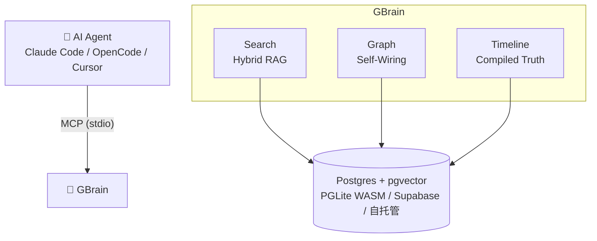

### 三大差异化能力

1. **自接线知识图谱** — 零 LLM 调用的实体关系提取，写即连线
2. **混合 RAG 搜索** — 向量 + 关键词 + 多查询扩展 + RRF 融合 + 4 层去重
3. **编译真理层** — 两层页面架构（编译真理 above / 时间线 below），信息不会过时

---

## Slide 3: 架构总览

### 四层架构

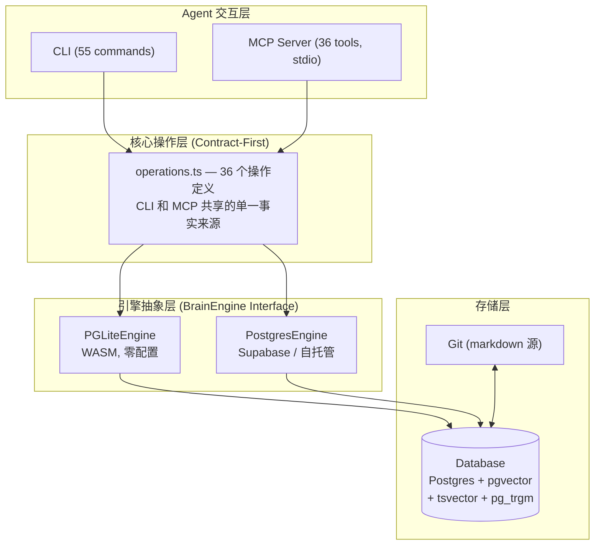

### 代码规模

| 指标 | 数值 |
|------|------|
| TypeScript 源文件 | 152 个 |
| 源代码行数 | 40,469 LOC |
| 测试文件 | 132 个 |
| 测试代码行数 | 32,092 LOC |
| 测试/源码比 | 0.79 |
| E2E 测试 | 27 个 (含 15 个 fixture 数据集) |
| 源目录数 | 19 个 |
| CLI 命令 | ~55 个 |
| MCP 工具 | 36 个 |
| Skills | 26 个 |

---

## Slide 4: 核心功能（一）— 混合搜索引擎

### 搜索管线

```
用户查询
    │
    ├──→ 向量搜索 (pgvector HNSW, cosine similarity)
    ├──→ 关键词搜索 (tsvector + ts_rank + websearch_to_tsquery)
    └──→ 多查询扩展 (生成替代表述)
            │
            ▼
      RRF 融合 (Reciprocal Rank Fusion)
            │
            ▼
      4 层去重 (compiled_truth > timeline > 其他)
            │
            ▼
      反向链接加权排序 (入链越多排名越高)
            │
            ▼
         返回结果
```

### 代码专用搜索

- 驼峰/蛇形/路径式查询自动检测
- 按文件/符号/import 分别索引
- 搜索结果附带 chunk metadata（文件路径、行号、符号名）

### BrainBench v1 基准数据

| 指标 | 无 Graph | 有 Graph | 提升 |
|------|---------|---------|------|
| Recall@5 | 83.1% | 94.6% | +11.5 pts |
| Precision@5 | 39.2% | 44.7% | +5.4 pts |
| Graph F1 | 57.8% (grep) | 86.6% | +28.8 pts |

---

## Slide 5: 核心功能（二）— 自接线知识图谱

### 零 LLM 调用的实体关系提取

每次写入页面 (`put_page`) 时自动触发：

```
页面内容 (markdown)
    │
    ▼
正则提取实体引用 (人名、公司名、项目名等)
    │
    ▼
pg_trgm 模糊匹配 → slug registry 解析
    │
    ▼
创建有类型链接
  attended / works_at / invested_in / founded / advises / ...
    │
    ▼
链接对账 (内容变更时移除过期链接)
    │
    ▼
图遍历查询 (graph-query, traverse_graph)
```

### 图操作

| 命令 | 功能 |
|------|------|
| `link <from> <to> --type` | 创建有类型链接 |
| `backlinks <slug>` | 查询反向链接 |
| `graph <slug> --depth N` | 图遍历 |
| `graph-query <slug> --type --direction` | 类型/方向过滤遍历 |
| `extract links` | 批量链接提取 (幂等) |

### 链接类型体系

支持多种关系类型：人员关系 (attended, works_at, founded, advises, invested_in)，知识关系 (references, extends, implements, depends_on)，时序关系 (follows, precedes)

---

## Slide 6: 核心功能（三）— 编译真理 + 时间线

### 两层页面架构

```
┌─────────────────────────────────┐
│  Compiled Truth (编译真理)       │  ← 永远是最新的综合结论
│  AI 维护，有新信息时重写          │
├─────────────────────────────────┤
│  Timeline (时间线)               │  ← 只追加，倒序排列
│  - 2026-05-10  会议纪要          │
│  - 2026-05-08  邮件摘录          │     原始证据日志
│  - 2026-05-05  电话记录          │
└─────────────────────────────────┘
```

### 设计目标

- **信息不会过时**: 编译真理始终是最新综合，时间线保留原始证据
- **可追溯**: 每个结论都能在时间线中找到原始来源
- **AI 友好**: agent 读编译真理获取结论，读时间线获取上下文

灵感来源: Karpathy 的 LLM wiki 模式

---

## Slide 7: 核心功能（四）— Minions 后台任务系统

### Postgres 原生的任务队列

```
┌──────────────────────────────────────────┐
│            Minions Job Queue              │
│                                          │
│  ┌─────────┐  ┌─────────┐  ┌─────────┐  │
│  │ Queue   │  │ Worker  │  │ Handler │  │
│  │ 1,152   │  │ Daemon  │  │ 内置 8  │  │
│  │ LOC     │  │         │  │ 个处理  │  │
│  │         │  │         │  │ 程序    │  │
│  └─────────┘  └─────────┘  └─────────┘  │
│                                          │
│  FOR UPDATE SKIP LOCKED (并发安全)        │
│  优先级队列 + 指数退避 + 速率限制          │
│  静默时段 + 错峰调度 + 进度上报            │
│  暂停/恢复/重放/干运行                    │
└──────────────────────────────────────────┘
```

### 内置 Handler

| Handler | 功能 |
|---------|------|
| sync | Git → DB 增量同步 |
| embed | 批量 embedding 生成 |
| lint | 页面质量检查 |
| import | 批量导入 |
| extract | 链接/时间线提取 |
| backlinks | 反向链接检查 |
| autopilot-cycle | 完整夜间维护周期 |
| subagent | 聚合子代理 (710 LOC) |

### 生产级特性

- SQL 级并发安全 (`FOR UPDATE SKIP LOCKED`)
- 指数退避重试 + 死信队列
- 速率租赁 (rate-leases) 防 API 过载
- 静默时段 (quiet-hours) 避开使用高峰
- MCP 安全边界：受保护的 job 名称 (shell 等) 禁止通过 MCP 提交

---

## Slide 8: 核心功能（五）— MCP 生态集成

### MCP Server (stdio)

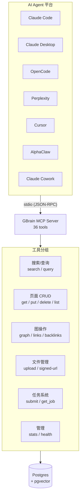

### 安全边界 (remote=true)

MCP 调用自动设置 `ctx.remote = true`，触发：
- 文件上传严格路径限制
- 禁止自动链接提取 (防止 prompt injection)
- 禁止自动时间线提取
- 受保护 job 名称拒绝执行
- `traverse_graph` 深度上限 10
- 结果列表 LIMIT 上限

### 支持的 Agent 平台

Claude Code, Claude Desktop, Claude Cowork, OpenCode, Perplexity, OpenClaw (AlphaClaw), Cursor, 及任何 stdio MCP 兼容平台。7 个部署指南文档。

---

## 管线可视化

### 项目架构思维导图

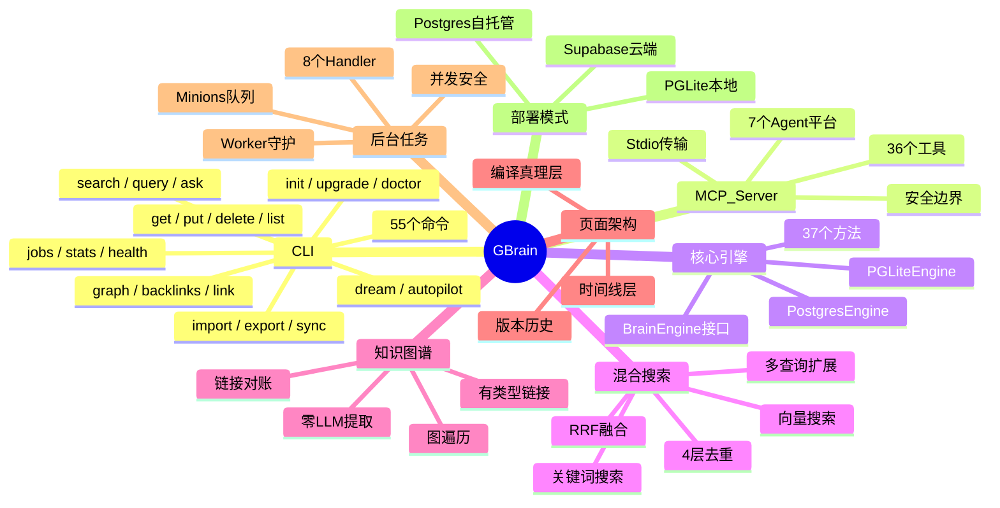

### 文件类型路由总览

GBrain 根据文件扩展名和 MIME 类型，将不同文件路由到不同的处理通道：

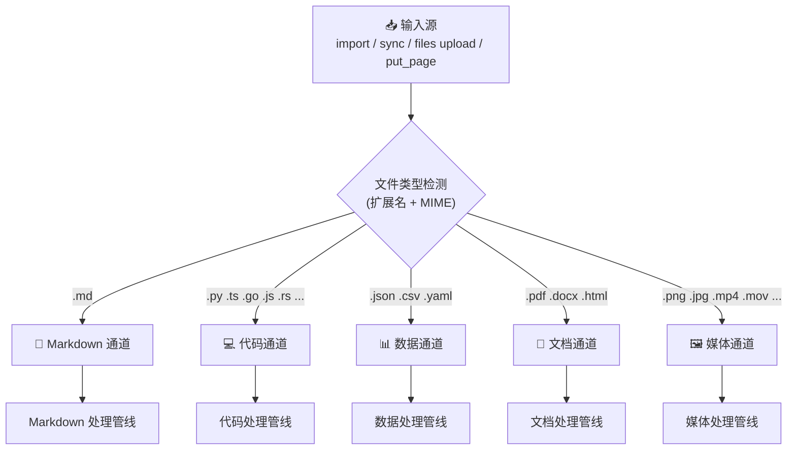

### Markdown 处理管线 (.md)

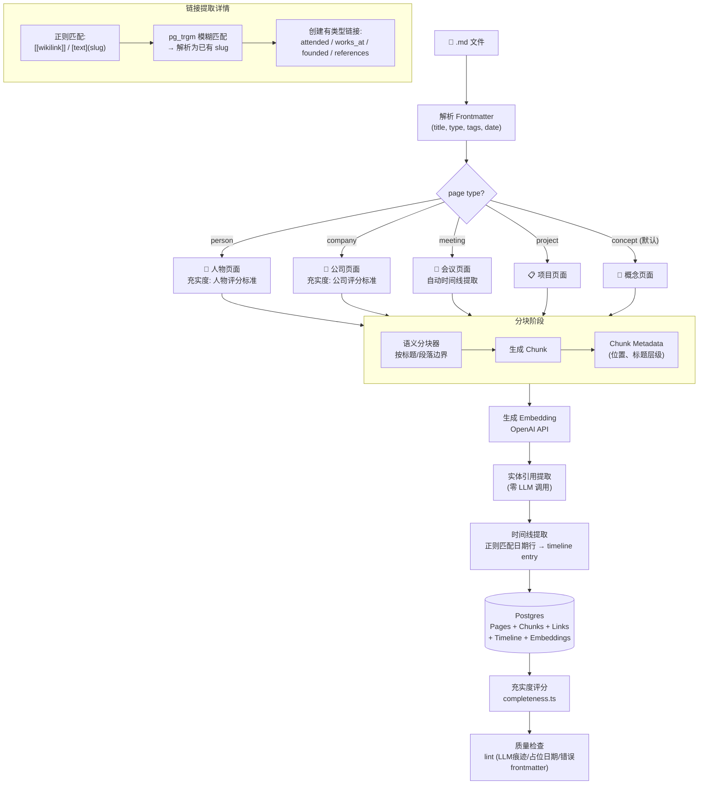

### 代码处理管线 (.py .ts .go .js ...)

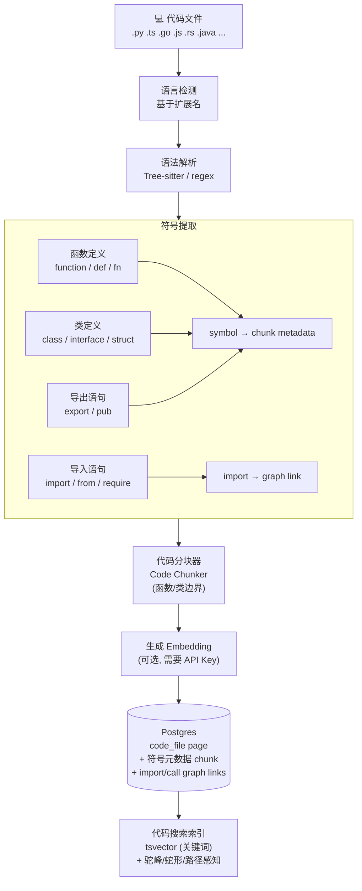

### 数据处理管线 (.json .csv .yaml)

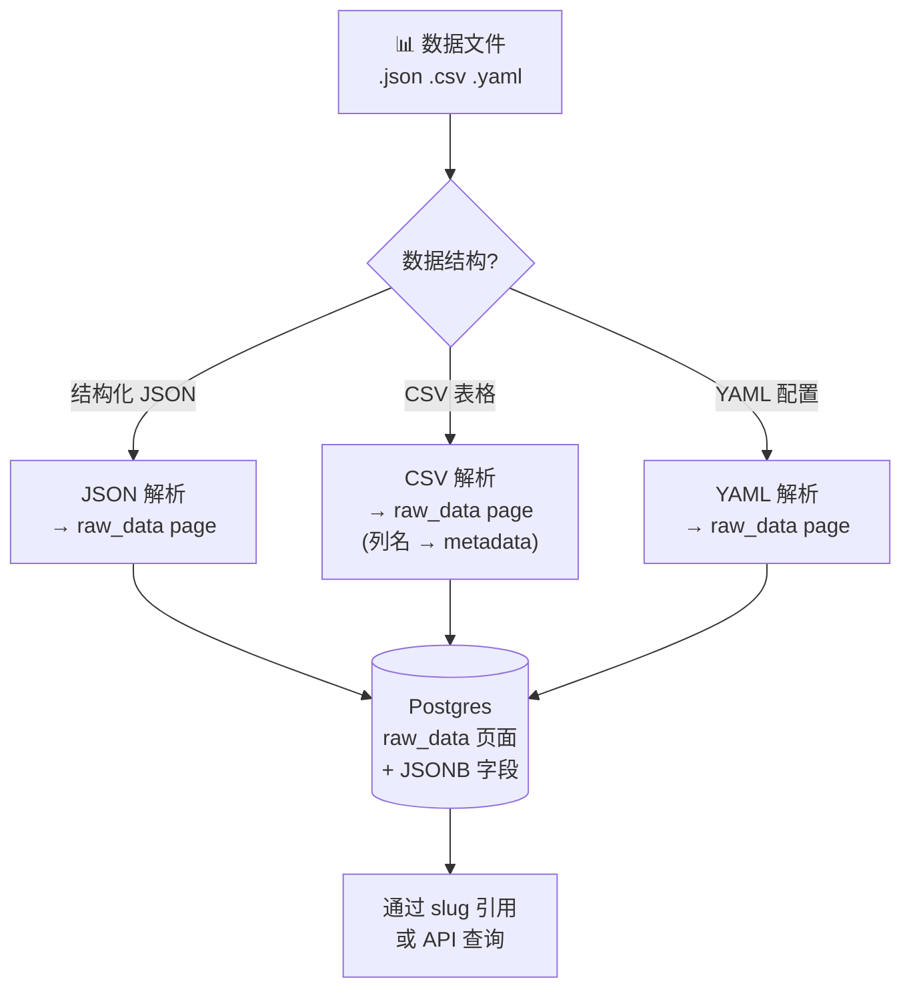

### 文档处理管线 (.pdf .docx .html)

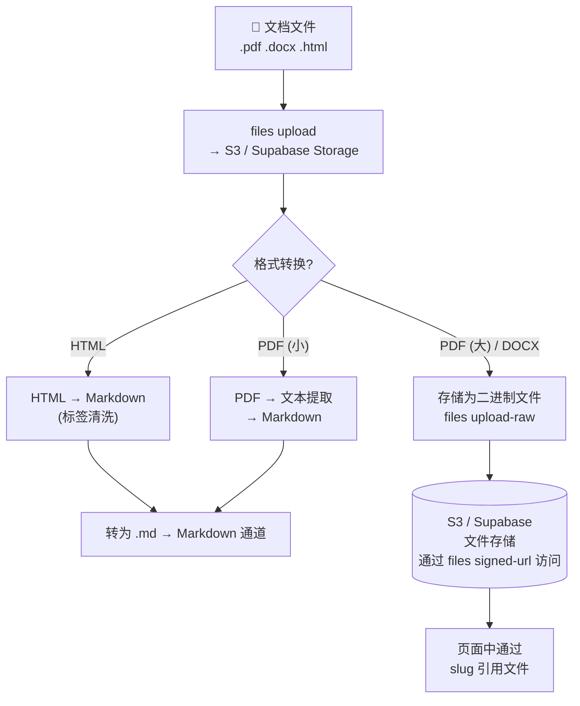

### 媒体处理管线 (.png .jpg .mp4 ...)

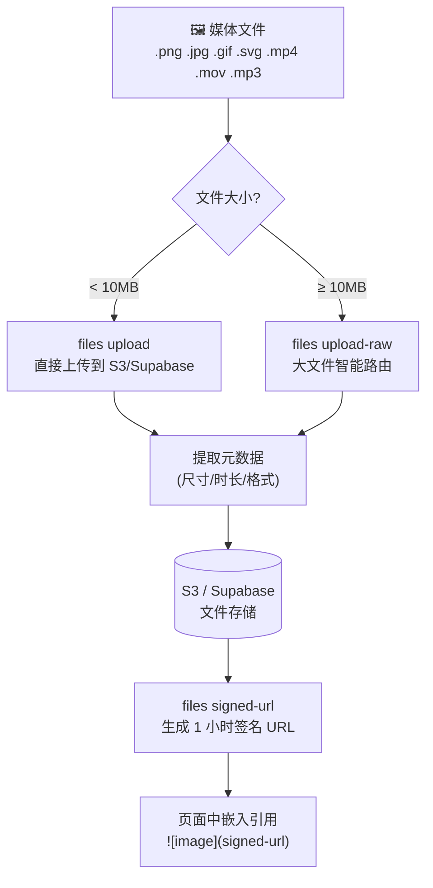

### 全文件类型处理对比

```mermaid
flowchart TB
    subgraph INPUTS["输入源"]
        IMP["gbrain import"]
        SYNC["gbrain sync"]
        UP["files upload"]
        PUT["put_page API"]
    end

    subgraph ROUTER["文件类型路由器"]
        R{"扩展名 / MIME 检测"}
    end

    subgraph MD_CH["Markdown 通道"]
        direction TB
        M1["Frontmatter 解析"] --> M2["类型路由\n(person/company/meeting/project/concept)"]
        M2 --> M3["语义/递归分块"]
        M3 --> M4["Embedding"]
        M4 --> M5["链接 + 时间线提取"]
        M5 --> M6["充实度评分"]
        M6 --> M7["Lint 质量检查"]
    end

    subgraph CODE_CH["代码通道"]
        direction TB
        C1["语言检测"] --> C2["符号提取\n(函数/类/import)"]
        C2 --> C3["代码分块"]
        C3 --> C4["Embedding (可选)"]
        C4 --> C5["imports → graph links"]
    end

    subgraph DATA_CH["数据通道"]
        direction TB
        D1["JSON/CSV/YAML 解析"] --> D2["raw_data page"]
    end

    subgraph DOC_CH["文档通道"]
        direction TB
        DC1["上传到 S3/Supabase"] --> DC2["HTML/PDF → Markdown 转换"]
        DC2 --> DC3["→ Markdown 通道"]
    end

    subgraph MEDIA_CH["媒体通道"]
        direction TB
        ME1["上传到 S3/Supabase"] --> ME2["元数据提取"]
        ME2 --> ME3["signed-url 引用"]
    end

    subgraph STORAGE["存储层"]
        PG[("Postgres\n+ pgvector")]
        S3[("S3 / Supabase Storage")]
    end

    IMP --> R
    SYNC --> R
    UP --> R
    PUT --> R

    R -- ".md" --> MD_CH
    R -- ".py .ts .go ..." --> CODE_CH
    R -- ".json .csv .yaml" --> DATA_CH
    R -- ".pdf .docx .html" --> DOC_CH
    R -- ".png .jpg .mp4 ..." --> MEDIA_CH

    MD_CH --> PG
    CODE_CH --> PG
    DATA_CH --> PG
    DOC_CH --> PG
    DOC_CH --> S3
    MEDIA_CH --> S3

### 处理管线

```mermaid
flowchart TB
    subgraph 写入触发
        A["put_page(slug, content)"]
    end

    subgraph 分块与嵌入
        B1["内容分块"] --> B2["生成 Embedding"]
        B2 --> B3["存储到 pgvector"]
    end

    subgraph 知识图谱
        C1["正则提取实体引用"] --> C2["pg_trgm 模糊匹配"]
        C2 --> C3["创建有类型链接"]
        C3 --> C4["链接对账 (移除过期)"]
    end

    subgraph 时间线
        D1["正则提取日期/摘要"] --> D2["追加到 Timeline"]
    end

    subgraph 充实度
        E1["实体类型识别"] --> E2["加权评分"]
        E2 --> E3["充实度报告"]
    end

    A --> B1
    A --> C1
    A --> D1
    B3 --> E1
    C4 --> E1
    D2 --> E1
```

### 查询管线

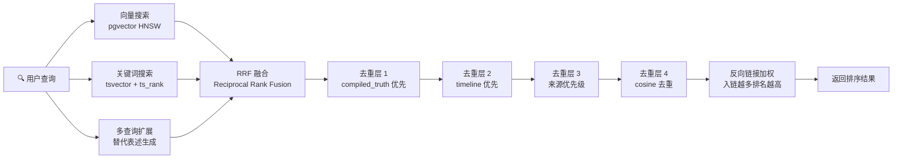

### 夜间维护管线 (dream / autopilot)

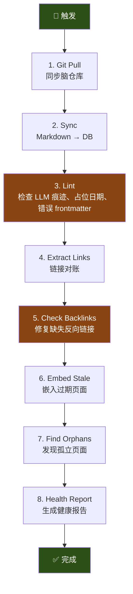

### 端到端系统全景图

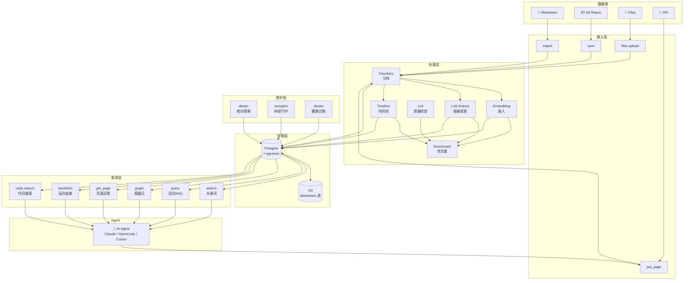

### Minions 任务队列并发模型

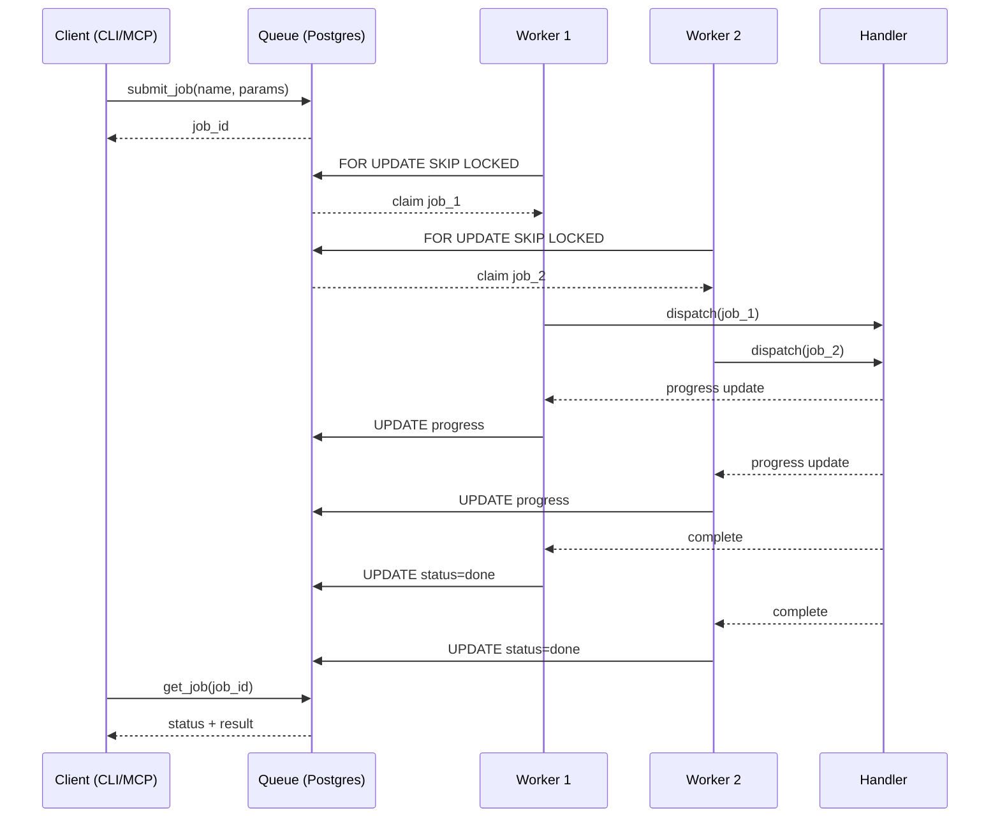

---

## Slide 9: 业务管线

### 数据管线全流程

```
┌─────────────────────────────────────────────────────────┐
│                    数据摄入层                             │
│                                                         │
│  Git Sync      Markdown      文件上传       API/Webhook  │
│  (增量同步)     Import        (S3/Supabase)  (自定义)    │
│  sync --watch  import <dir>   files upload                │
└──────────────────────┬──────────────────────────────────┘
                       │
┌──────────────────────▼──────────────────────────────────┐
│                    处理管线                               │
│                                                         │
│  分块 (Chunkers)    链接提取       时间线提取             │
│  semantic/recursive  link-extract   timeline-extract     │
│  LLM/code            零 LLM 调用     正则自动提取         │
│                                                         │
│  Embedding          充实度评分      质量检查              │
│  OpenAI API          completeness   lint                  │
└──────────────────────┬──────────────────────────────────┘
                       │
┌──────────────────────▼──────────────────────────────────┐
│                    存储层                                 │
│                                                         │
│  Git 仓库 (源)     ←→   Postgres + pgvector (索引)       │
│  markdown 文件           Pages + Chunks + Links           │
│                           + Timeline + Embeddings         │
└──────────────────────┬──────────────────────────────────┘
                       │
┌──────────────────────▼──────────────────────────────────┐
│                    查询层                                 │
│                                                         │
│  关键词搜索      混合 RAG 搜索    图遍历                 │
│  search          query / ask       graph / graph-query   │
│                                                         │
│  代码搜索        反向链接          页面读取               │
│  code search     backlinks         get_page              │
└──────────────────────┬──────────────────────────────────┘
                       │
┌──────────────────────▼──────────────────────────────────┐
│                    维护管线                               │
│                                                         │
│  dream (夜间周期)           autopilot (持续守护)          │
│  lint → extract → embed    循环执行 + cron 调度           │
│  → backlinks → health                                   │
└─────────────────────────────────────────────────────────┘
```

---

## Slide 10: 部署管线

### 三种部署模式

| 模式 | 引擎 | 适用场景 |
|------|------|---------|
| **零配置本地** | PGLite WASM | 个人开发者，< 1,000 页面，2 秒启动 |
| **自托管** | Postgres + pgvector | 团队使用，自建服务器 |
| **云端** | Supabase | 生产环境，10K+ 页面，连接池 |

### 安装流程 (~30 分钟)

```bash
# 1. 安装
npm install -g gbrain

# 2. 初始化 (PGLite 零配置)
gbrain init

# 3. 导入内容
gbrain import ~/notes/
gbrain sync --repo ~/project/ --include-code

# 4. 注册到 AI Agent
# 编辑 ~/.config/claude-code/settings.json:
# { "mcp": { "gbrain": { "command": ["gbrain", "serve"] } } }
```

### 迁移支持

```bash
gbrain migrate --to supabase    # PGLite → Postgres (升级)
gbrain migrate --to pglite      # Postgres → PGLite (降级/备份)
```

### 数据库引擎对比

| 特性 | PGLite | Postgres |
|------|--------|----------|
| 启动时间 | 2 秒 | 需配置 |
| pgvector HNSW | ✅ | ✅ |
| tsvector + GIN | ✅ | ✅ |
| pg_trgm | ✅ | ✅ |
| 并发连接 | 单进程 | 连接池 (Supavisor) |
| 最大推荐页面 | < 1,000 | 10,000+ |
| 零配置 | ✅ | 需要连接 URL |

---

## Slide 11: 开发管线

### 技术栈

| 层面 | 技术 |
|------|------|
| 语言 | TypeScript (ESM) |
| 运行时 | Bun |
| 数据库 | Postgres 17.5 + pgvector |
| WASM 引擎 | @electric-sql/pglite |
| MCP 协议 | @modelcontextprotocol/sdk v1.0 |
| 搜索 | tsvector + pgvector HNSW + pg_trgm |
| 嵌入 | OpenAI Embeddings API |
| 测试 | Bun test + 自定义 E2E 框架 |
| 类型检查 | TypeScript strict mode |

### 代码组织

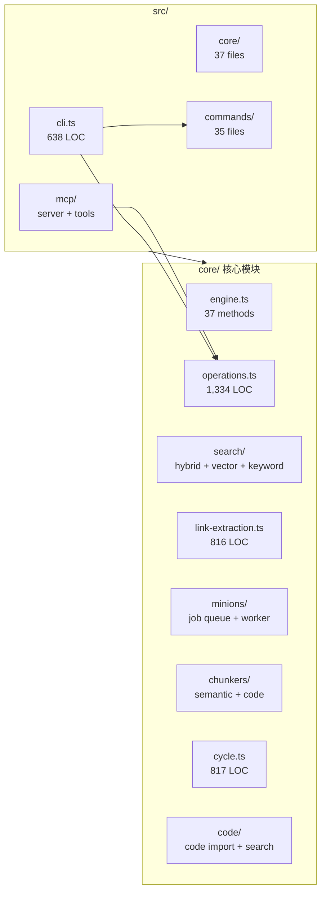

### 工程质量

- 132 个测试文件，32K+ 行测试代码
- 27 个 E2E 测试覆盖核心管线
- Contract-First 设计：`operations.ts` 是 CLI 和 MCP 的单一事实来源
- 双引擎架构：同一套 SQL 在 PGLite WASM 和 Postgres 上运行
- 引擎间双向迁移测试

---

## Slide 12: 技术贡献

### 1. 自接线知识图谱 (零 LLM 调用)

正则驱动的关系提取，不需要调用 LLM 就能在页面间建立有类型链接。写入一个页面，自动发现并连接已存在的相关实体。BrainBench v1 证明：Graph F1 86.6% vs grep 57.8%。

### 2. 编译真理层架构

受 Karpathy LLM wiki 启发，两层页面架构让 AI 维护的知识库始终保持"最新综合结论 + 原始证据链"，解决了传统 wiki 信息过时的问题。

### 3. Pluggable Engine 抽象

BrainEngine 接口 (37 methods) 定义了完整的知识脑契约。两个实现共享同一套 SQL 和测试。新增引擎只需实现接口即可获得完整的 CLI + MCP + 搜索 + 图能力。

### 4. MCP 安全保障

`remote=true` 标志在 MCP 调用链中自动传播，实现了细粒度的安全边界：禁止 prompt injection (禁用 link extraction)、文件上传路径限制、job 名称白名单、图遍历深度限制。

### 5. SQL 级并发安全

Minions 任务队列使用 `FOR UPDATE SKIP LOCKED` 实现无锁并发 worker。E2E 测试验证：2 workers + 20 jobs → 恰好 20 完成，零重复认领，零遗漏。

---

## Slide 13: 生态贡献

### 开源工具链

| 工具 | 说明 |
|------|------|
| GBrain CLI | 55 个命令，覆盖知识脑全生命周期 |
| MCP Server | 36 个工具，7 个 Agent 平台已适配 |
| Skills Pack | 26 个技能模板，30 个使用指南 |
| repo-analyzer | Git 仓库分析 + wiki 自动生成 |
| E2E 测试框架 | 含 15 个 fixture 数据集，可复现基准 |

### 文档体系

| 类别 | 数量 | 内容 |
|------|------|------|
| 使用指南 | 30 个 | brain-agent loop, search modes, enrichment pipeline 等 |
| 架构文档 | 3 个 | infra-layer, Knowledge Runtime, Minions |
| MCP 部署 | 7 个 | 各 Agent 平台的 GBrain MCP 配置指南 |
| 集成方案 | 4 个 | credential-gateway, meeting-webhooks, reliability-repair |
| 设计文档 | 4 个 | Homebrew for Personal AI, 编译真理, 充实度管线 |
| 基准报告 | 5 个 | BrainBench v1, Minions vs OpenClaw, Knowledge Runtime v0.13 |

### 可复现基准

- **BrainBench v1**: 240 页 Claude Opus 生成语料库，完整检索质量评估
- **Minions vs OpenClaw**: 耐久性/吞吐/扇出/内存 4 维度对比
- **Knowledge Runtime v0.13**: 写入延迟/查询就绪时间/完整性修复率
- 所有基准含源码和复现指令

---

## Slide 14: 项目健康度

### 代码质量

| 指标 | 数值 |
|------|------|
| 测试/源码比 | 0.79 (32K / 40K LOC) |
| E2E 覆盖 | 27 个测试场景 |
| 引擎实现 | 2 个 (PGLite + Postgres) |
| 共享 SQL | 同一套 DDL 在两引擎运行 |

### 功能完整度

| 子系统 | 状态 | 说明 |
|--------|------|------|
| 页面 CRUD | ✅ | 含版本历史 + 回滚 |
| 混合搜索 | ✅ | 向量 + 关键词 + 扩展 + RRF |
| 知识图谱 | ✅ | 零 LLM 自接线 + 对账 |
| 时间线 | ✅ | 编译真理 + 原始证据两层 |
| 后台任务 | ✅ | 队列 + Worker + 8 个 Handler |
| MCP Server | ✅ | 36 tools, 7 platform guides |
| 代码索引 | ✅ | code import + code search |
| 充实度评分 | ✅ | 7 种实体类型评分标准 |
| 夜间维护 | ✅ | dream + autopilot 两种模式 |
| 仓库分析 | ✅ | Git 仓库 → wiki 自动生成 |
| 引擎迁移 | ✅ | PGLite ↔ Postgres 双向 |
| Skills 系统 | ✅ | 26 skills, contract-first |

### 测试层次

```
E2E Tests (27)
  ├── Tier 1 (无 API Key, PGLite 内存): 搜索质量, 图质量, MCP, Skills, 迁移
  └── Tier 2 (需要 DATABASE_URL, 真实 Postgres): 同步, 周期, Minions 并发, 升级

Benchmarks (5)
  ├── BrainBench v1 (检索质量)
  ├── Minions vs OpenClaw (4 维度)
  └── Knowledge Runtime v0.13 (延迟/修复率)

Unit Tests (132)
  └── 32,092 LOC, 覆盖所有核心模块
```

---

## Slide 15: 总结

### GBrain 是什么

一个为 AI agent 提供**持久化知识记忆**的 Postgres 原生个人知识脑。

### 核心能力

| 能力 | 实现 |
|------|------|
| 搜索 | 混合 RAG (向量 + 关键词 + 扩展 + RRF 融合) |
| 图谱 | 自接线知识图谱 (零 LLM 调用) |
| 记忆 | 编译真理 + 时间线两层架构 |
| 自动化 | Minions 任务队列 + autopilot 持续守护 |
| 集成 | MCP Server (36 tools, 7 platforms) |

### 关键数据

| 指标 | 数值 |
|------|------|
| 代码规模 | 40K LOC + 32K 测试 |
| 生产验证 | 17,888 pages, 21 cron jobs |
| 开源许可 | MIT |
| 安装时间 | ~30 分钟 |
| 数据库启动 | 2 秒 (PGLite WASM) |
| MCP 工具 | 36 个 |
| Agent 平台 | 7 个已适配 |
